In this guide, I'll walk through how to take a 3D model from CAD software to a metal 3D-printed part using PCBWay (https://www.pcbway.com/). This is the same workflow I used for my recent YouTube Short, *[This isn't plastic… it's real metal]()*, where I turned a digital design into a real manufactured metal component.

### Step 1: Download and install a CAD software

You can use online CAD services such as Onshape (https://www.onshape.com/en/) or Tinkercad (https://www.tinkercad.com/), but for this guide I am going to be showing you how to create a ball using FreeCAD, a free and open-source CAD software.

Go on over to FreeCAD's website at [https://www.freecad.org/](https://www.freecad.org/) and then click "Download now," then choose your operating system (OS)/architecture (x86 or aarch64 or ARM). Once the installer file (.dmg, .exe, .7z, .AppImage) has finished downloading, you can proceed to install it, typically by double clicking the file to launch it.

> [!TIP] You can also find FreeCAD files like a specific version or the latest release at: [https://github.com/FreeCAD/FreeCAD/releases](https://github.com/FreeCAD/FreeCAD/releases)

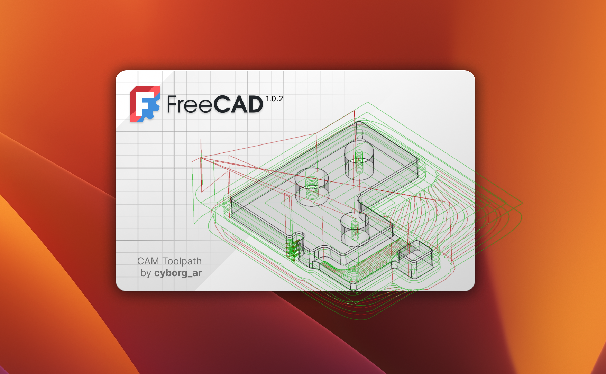

### Step 2: Create an empty file in FreeCAD

Click the "*Create a new empty FreeCAD file*" button titled "*Empty file*"

Once you click "*Empty file*" you should be greeted with a blank page similar to this.

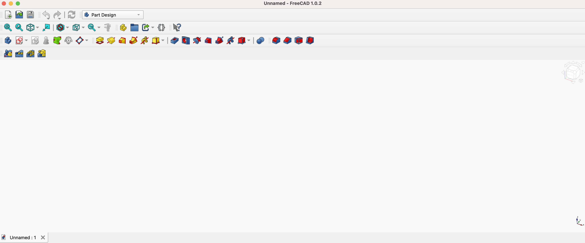

You might feel overwhelmed by all of the icons on the top, but right now all that we care about is the icon that looks like a square with a circle in it (see Image 1). The icon the red arrow is pointing to. If you hover over it, a small box will pop up that says "Create sketch" (see Image 2). You are going to want to click on it.

| Image 1 | Image 2 |
|--------|--------|
| 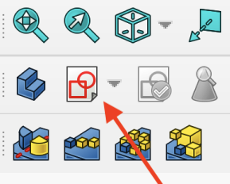 | 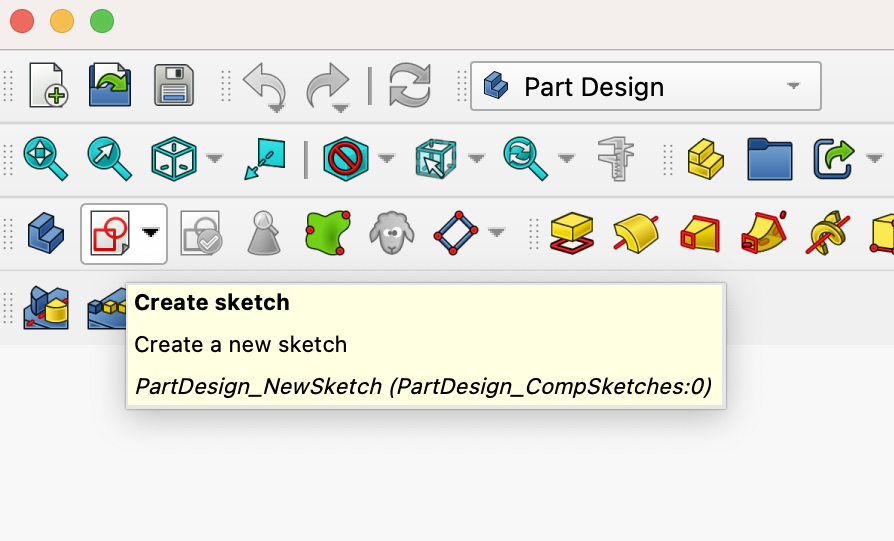 |

### Step 3: Create a new sketch in FreeCAD

After clicking on the icon from Image 1 above you should be greeted with the following view:

Choose a plane you want to work on. On the left I recommend choosing XY-plane (Base plane). The one you choose doesn't really matter, but XY-plane is easy because it is flat.

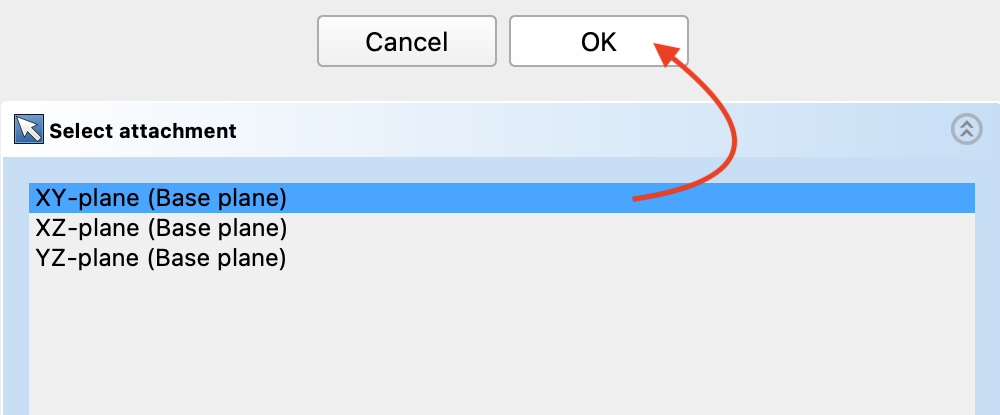

Once you choose the plane you are going to work on, click the button that says "*OK*."

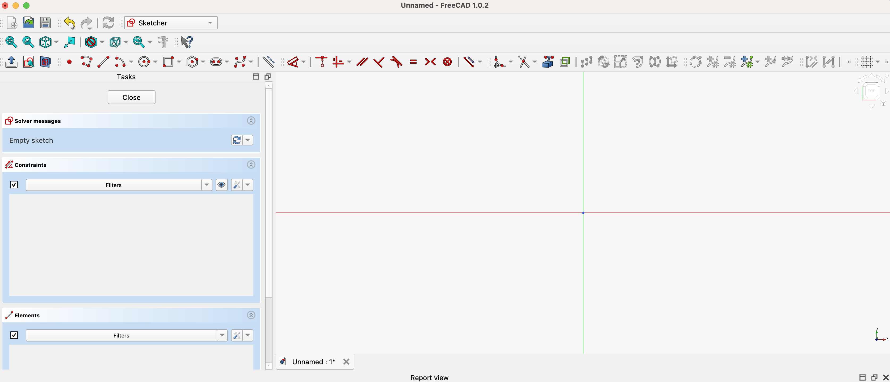

Now just like when you were first greeted with a blank white screen with tons of icons up top, this page is a tool called Sketcher and there are a lot of icons. From here on, I will show you how to make a simple ball and how to take that 3D model, in this case the ball, from CAD software to a metal 3D-printed part using PCBWay.

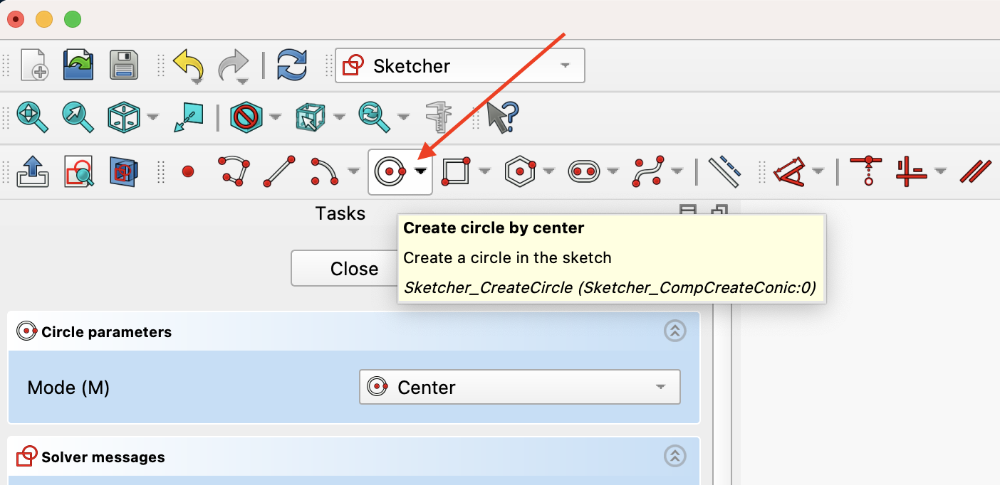

Go ahead and click the icon that shows a circle with two red dots, one in the center and one on the right.

Then click the canvas (the red and green lines). You can click anywhere but I prefer to click in the center (see Image 1 below). Then type 1.680" (1.680 inches is the size of a golf ball), also see Image 2 below.

| Image 1 | Image 2 |
|--------|--------|
| 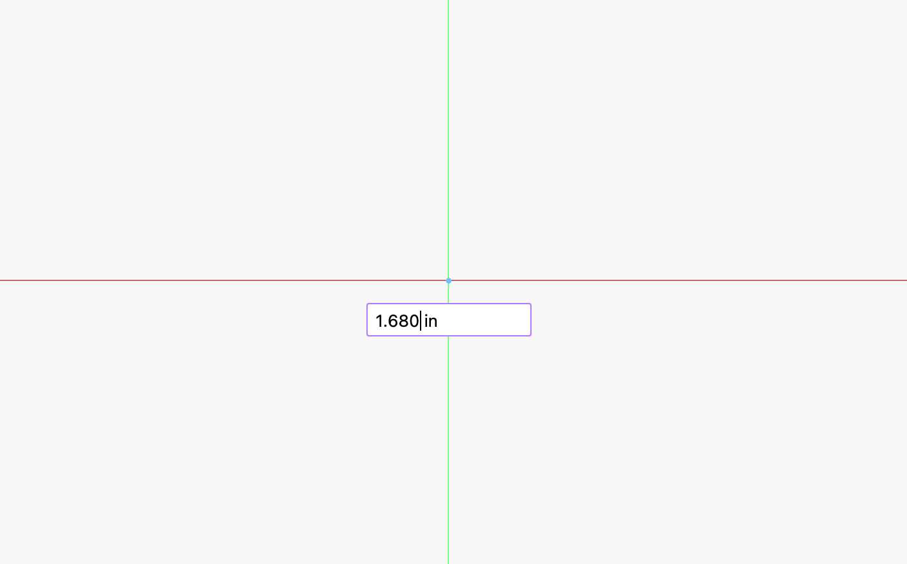 | 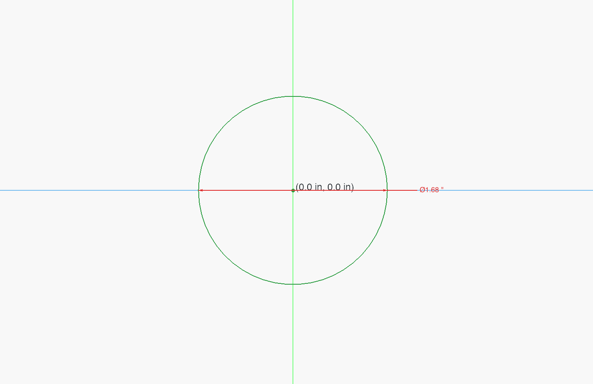 |

After you have drawn your shape, in this case a circle that is 1.680", go to the top of FreeCAD to where it says Sketcher. It should look like a dropdown, click it and choose the option called "*Part*," it should have a blue cube on the left.

### Step 4: Create a new Part in FreeCAD

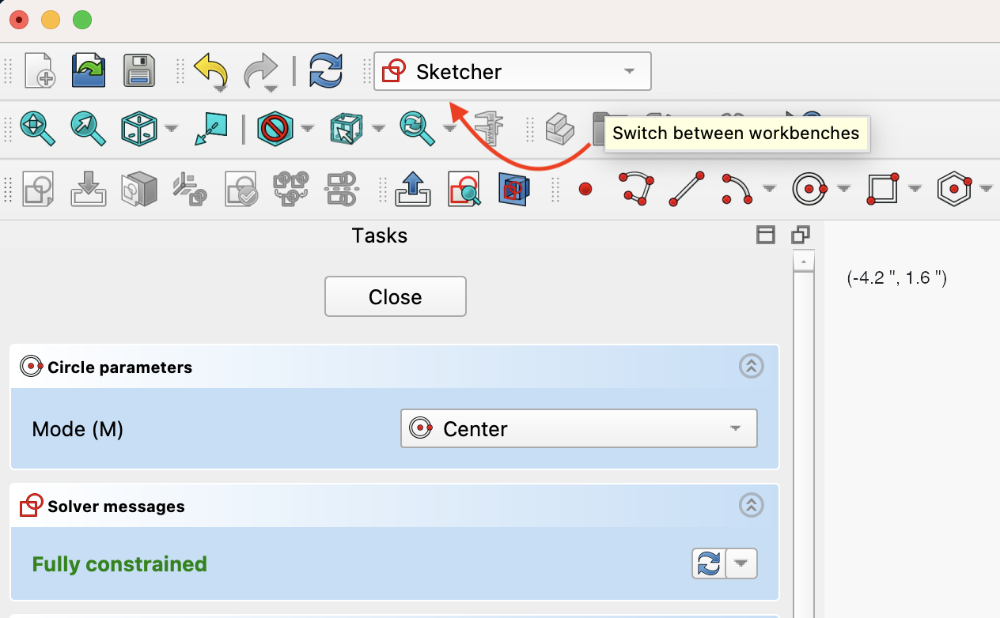
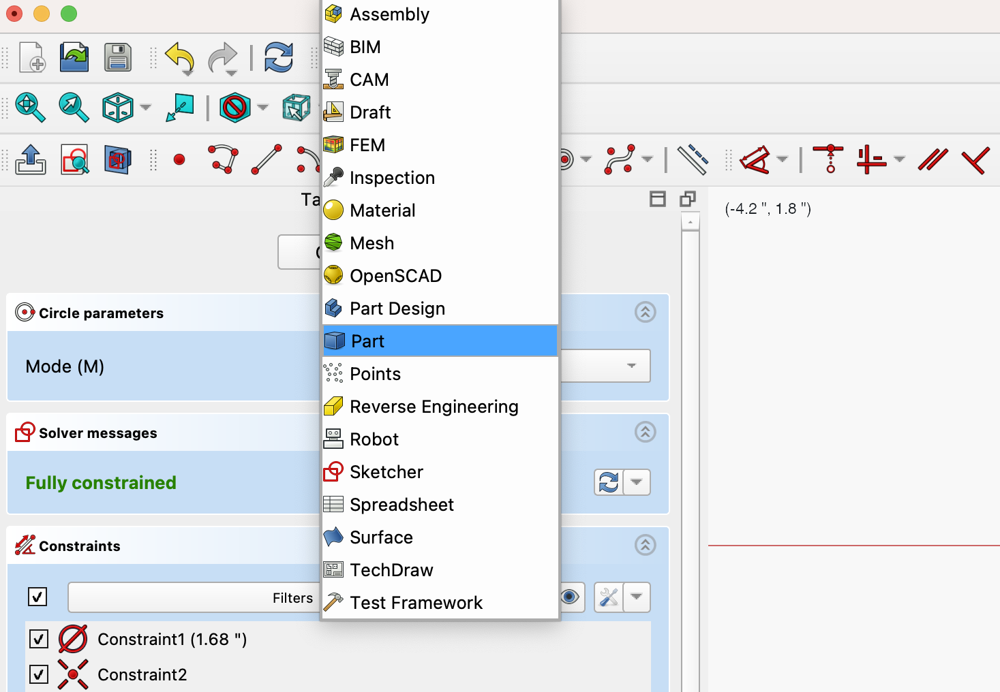

Once you are in the Part workbench, click the shape outline so it turns blue, then go up to the toolbar and click the sphere icon.

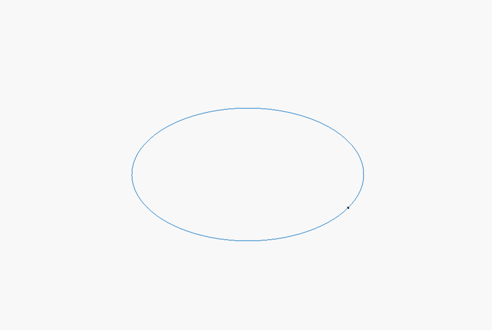

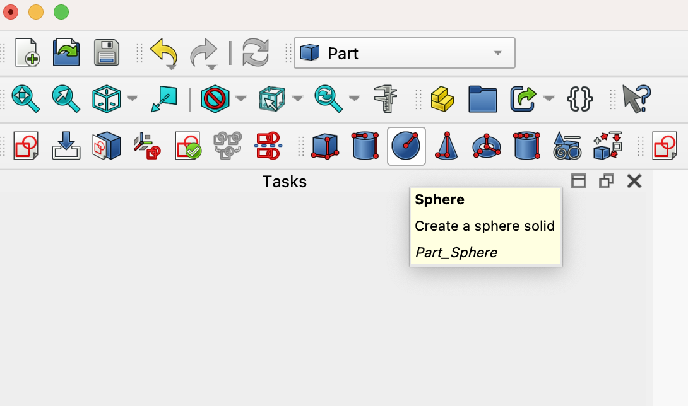

And that's it! FreeCAD will turn your circle into a 3D sphere.

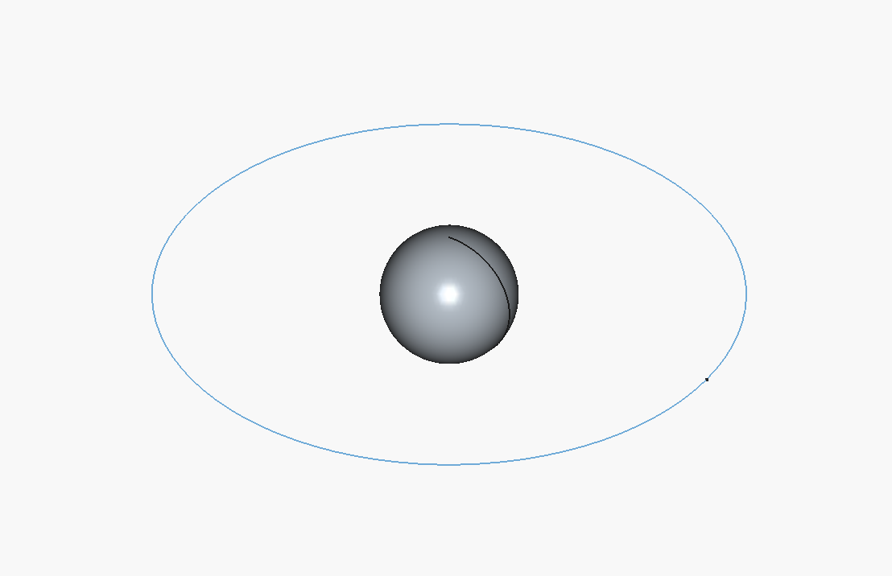

### Step 5: Export your model from FreeCAD

Before exporting your CAD model, make sure it is selected. It should turn blue, as shown in the image below:

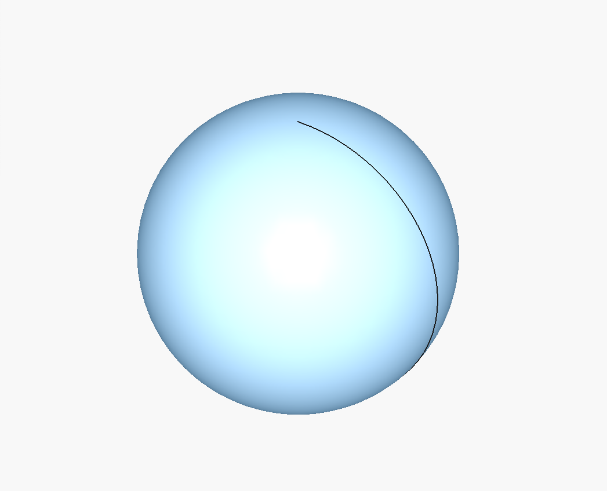

Once the object/shape is highlighted in blue, go to **File → Export** and save it as one of the following file types: `.stl`, `.obj`, `.step`, or `.stp`.

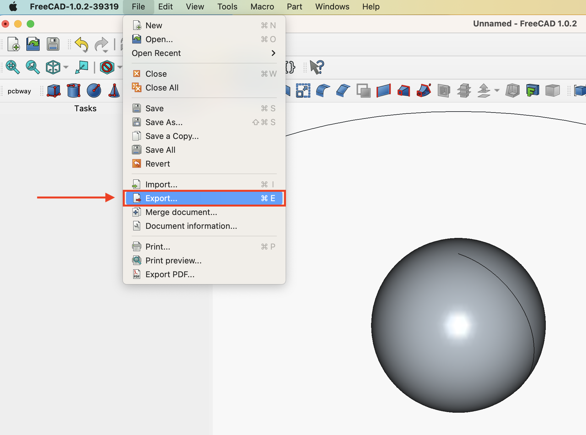

In this example, the CAD file is saved as `metal_ball.stl`.

After exporting your file, head over to PCBWay to upload your model and place your order.

### Step 6: Order your Part from PCBWay

Now that you’ve exported your CAD file, it’s time to actually get it made.

Head over to https://www.pcbway.com/rapid-prototyping/manufacture/ and go to the **3D printing** section. From there, click something like **Quote Now** to start a new order.

Upload your exported file (`.stl`, `.obj`, `.step`, or `.stp`). Once it uploads, PCBWay will automatically process it and show you a preview of your model.

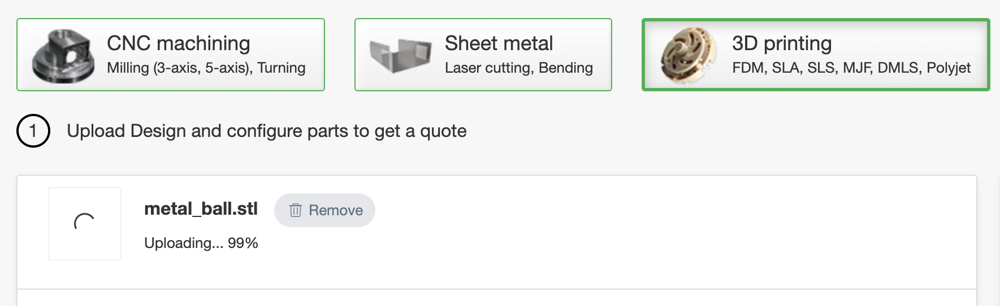

After that, you’ll configure your part:

- **Material** – Pick the metal you want (stainless steel, aluminum, etc.)
- **Quantity** – How many you want printed.

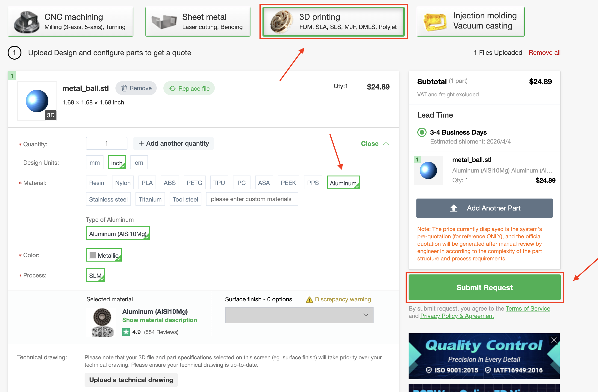

As you change settings, the price and lead time will update automatically.

Once everything looks good, add it to your cart and go through checkout—just enter your shipping info and payment like normal.

After placing the order, PCBWay will handle the manufacturing, and you’ll get updates along the way until it ships.