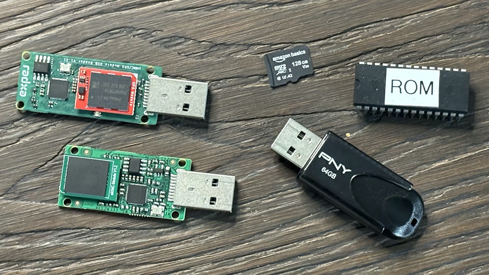
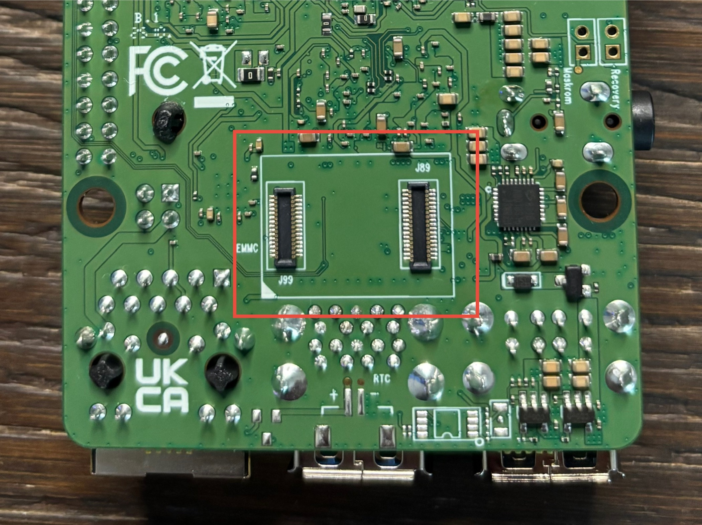
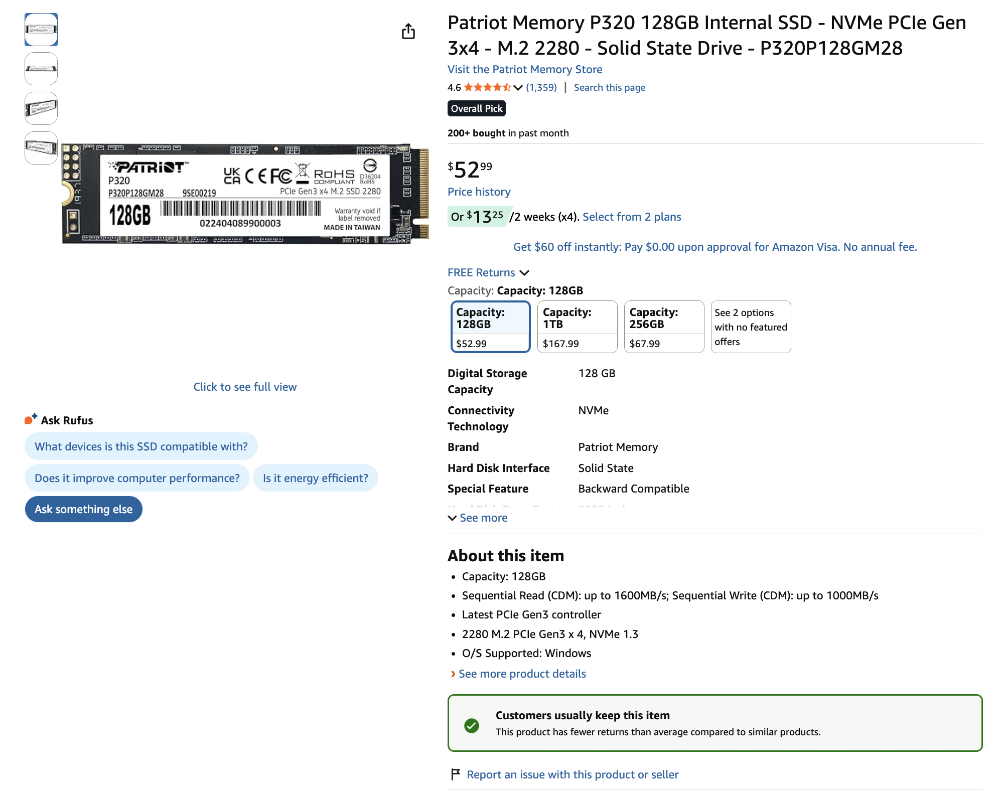
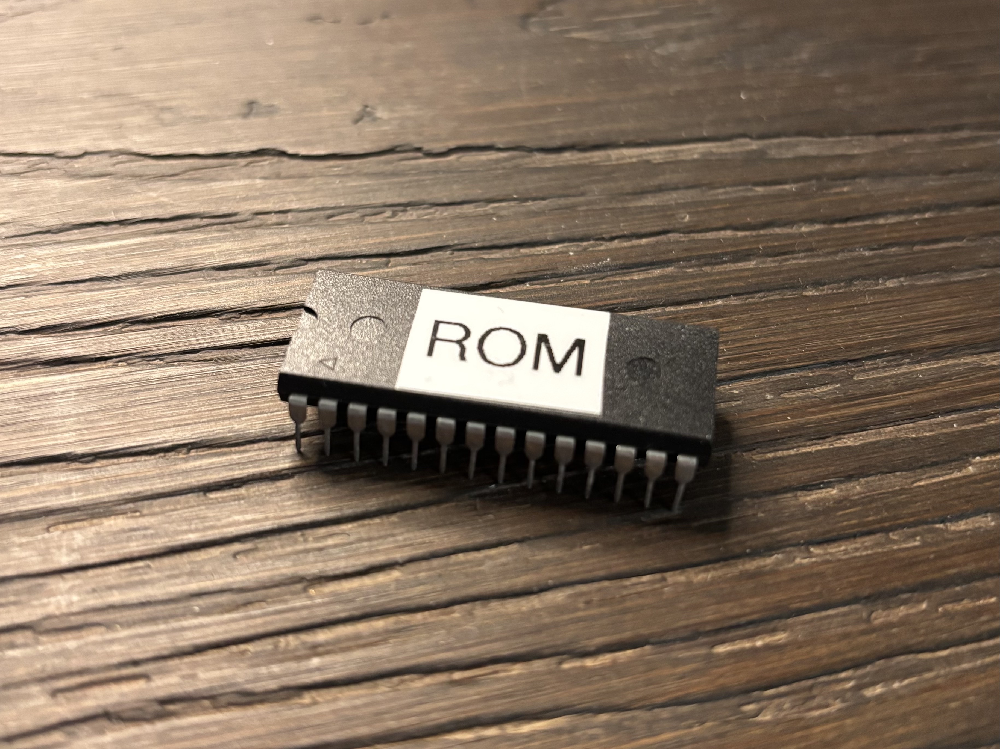

This isn’t supposed to be yet another storage comparison that explains what the difference between NVMe, microSD, and eMMC storage media is. It is just a baseline comparison of storage media that you might see in an SBC (minus the EEPROM part, I’ll explain what I mean later).

I have always used microSD cards for my Raspberry Pi projects and never really thought about using NVMe drives via PCIe ports or using another storage media like maybe a USB thumb drive to run an OS from.

Until now. Recently, I got my hands on [Radxa’s ROCK 5C](https://ryderhutchings.com/videos/is-the-radxa-rock-5c-the-most-powerful-budget-sbc/), and with it Radxa sent over an eMMC module that connected to the SBC on the bottom. This small little surprise sent me down a rabbit hole on storage.



Don’t get me wrong, I have always been aware of the many different storage types:

HDD, SSD, SD cards, microSD cards, floppy disk drives...

But when it came to Raspberry Pi projects and SBCs, I kind of just assumed without reason that microSD cards were the only storage type used in SBCs, disregarding the fact that the first gen Raspberry Pi used a full sized SD card. I just thought microSD was the only media type used in single board computers. Until I started to explore other SBCs from different manufacturers than Raspberry Pi.

eMMC, for example, was faster than the microSD cards I had used in the past, and I just started to wonder why more SBCs didn’t use it.

Then, when the Raspberry Pi 5 was officially released with support for PCIe Gen 2.0 speeds, but with an easy workaround for Gen 3.0 speeds, I picked up a cheap Raspberry Pi M.2 HAT and an accompanying NVMe drive.



After running a Raspberry Pi operating system from the NVMe drive for a while, I am now hesitant to go back to using microSD cards for running my operating system (OS) just because an NVMe SSD is magnitudes faster and more reliable for data longevity.

So instead of just going off feel, I decided to measure it. I ran benchmarks across NVMe, UFS, eMMC, microSD, and USB storage to see how they actually compare.

Now take these results with a grain of salt. They are not set in stone, and you may see better or worse performance depending on factors outside of my control if you attempt to recreate these tests.

---

## Benchmark Methodology

All benchmarks were performed using `fio` directly on SBC hardware to reflect real-world storage performance.

### Test System
- Device: Raspberry Pi 5  
- OS: Raspberry Pi OS (Bookworm)  
- Kernel: Linux 6.12.34+rpt-rpi-2712  
- Architecture: aarch64 (64-bit)  


### General Configuration
- Direct I/O enabled (`--direct=1`) to bypass OS caching
- `libaio` used as the I/O engine
- Tests run on mounted storage devices

### Sequential Tests

Sequential read and write performance were measured using large block sizes.

**Configuration:**
- Block size: `1M`
- I/O depth: `1`
- Access pattern: `read` / `write`

**Example Commands:**
```bash
fio --name=seqread \
    --filename=/path/to/testfile \
    --size=1G \
    --bs=1M \
    --rw=read \
    --direct=1 \
    --ioengine=libaio \
    --iodepth=1

fio --name=seqwrite \
    --filename=/path/to/testfile \
    --size=512M \
    --bs=1M \
    --rw=write \
    --direct=1 \
    --ioengine=libaio \
    --iodepth=1
```

### Random 4K Tests

Random performance was measured using a mixed read/write workload.

**Configuration**:

- Block size: ``4K``
- Access pattern: ``randrw``
- Read/write mix: ``70% read / 30% write``
- I/O depth: ``4``

**Example Command**:
```bash
fio --name=rand \
    --filename=/path/to/testfile \
    --size=128M \
    --bs=4k \
    --rw=randrw \
    --rwmixread=70 \
    --direct=1 \
    --ioengine=libaio \
    --iodepth=4
```

**Device-Specific Notes**
- NVMe tests used up to 1G workloads for sustained performance
- UFS and eMMC tests used 512M (sequential) and 128M (random)
- microSD tests were performed on the same system under typical SBC conditions
- USB drive tests reflect real-world flash drive limitations


## Results

### Sequential Performance (MB/s)
| Media     | Read (MB/s) | Write (MB/s) |
|-----------|------------|-------------|
| NVMe      | 785        | 514         |
| UFS       | 97.7       | 128         |
| eMMC      | 250        | 92.2        |
| microSD   | 94.3       | 75.5        |
| USB       | 35.8       | 6.0         |


### Random 4K Performance (IOPS)
| Media     | Read (IOPS) | Write (IOPS) |
|-----------|------------|-------------|
| NVMe      | 21900      | 9359        |
| UFS       | 2480       | 799         |
| eMMC      | 2055       | 877         |
| microSD   | 1619       | 692         |
| USB       | 3          | 1.5         |


### Latency (ms)
| Media     | Avg Latency (ms) |
|-----------|------------------|
| NVMe      | 0.16             |
| UFS       | 1.59             |
| eMMC      | 1.29             |
| microSD   | ~1.5             |
| USB       | 566              |

---
## Something Weird... Let's Talk About EEPROM

*The chip shown in the image is an **Atmel 28C256 (32 KB EEPROM)**.*

And separately, Electrically Erasable Programmable Read-Only Memory (EEPROM) is not comparable to something like an NVMe SSD or microSD card. The reason I included it here is that I am working on a homebrew 6502 computer and am just fascinated by EEPROMs and how 40 years ago 1MB of storage was a long shot, and now we have petabytes (1,000 TB = 1 PB) of storage capacity in data centers, and you can have hundreds if not thousands of terabytes (terabyte = 1,000 GB) of storage.

There isn’t exactly a real way to benchmark EEPROMs in the same way as you would other types of media, so these numbers are theoretical but still hold true. 

### EEPROM Performance (Byte-Level)
| Media  | Read (B/s)                         | Write (B/s)                                                       |
| ------ | ---------------------------------- | ----------------------------------------------------------------- |
| EEPROM | N/A (byte access, ~100 ns latency) | N/A (≈100–200 bytes/ms effective write depending on cycle timing) |


To conclude this post, I will eventually turn this into a video on my channel. Until then, I am Ryder, and I hope you learned something new.