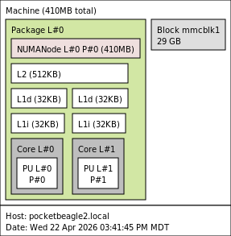

+++
title = "Revisiting the BeagleBoard PocketBeagle 2"
date = "2026-04-26"
draft = "true"
description = ""
tags = [
    "Benchmarks",
    "SBC",
]
+++

### Summary

- PocketBeagle 2 (TI AM6254), 2 Cortex-A53 cores available @ ~1 GHz  
- 512 MB RAM (≈410 MB usable), heavy swap usage (3.2 GB)  
- microSD storage with swap enabled  
- Debian 13 (Trixie)  
- No GPU or hardware acceleration  

---
### Basic Information

  - Mfr. URL (official): [beagleboard.org](https://www.beagleboard.org/boards/pocketbeagle-2)
  - Board purchased from: N/A (provided by BeagleBoard)
  - Board purchase date: N/A
  - Board specs (as tested): N/A
  - Board price (as tested): $28.13

### Linux/System Information

```
# output of `screenfetch`
         _,met$$$$$gg.           ryderhutchings@pocketbeagle2.local
      ,g$$$$$$$$$$$$$$$P.        OS: Debian 13 trixie
    ,g$$P""       """Y$$.".      Kernel: aarch64 Linux 6.18.10-arm64-k3-r23
   ,$$P'              `$$$.      Uptime: 2h 16m
  ',$$P       ,ggs.     `$$b:    Packages: 891
  `d$$'     ,$P"'   .    $$$     Shell: bash 5.2.37
   $$P      d$'     ,    $$P     Disk: 25G / 29G (92%)
   $$:      $$.   -    ,d$$'     CPU: ARM Cortex-A53 @ 2x 1GHz
   $$\;      Y$b._   _,d$P'      RAM: 154MiB / 410MiB
   Y$$.    `.`"Y$$$$P"'         
   `$$b      "-.__              
    `Y$$                        
     `Y$$.                      
       `$$b.                    
         `Y$$b.                 
            `"Y$b._             
                `""""                                      

# output of `uname -a`
Linux pocketbeagle2.local 6.18.10-arm64-k3-r23 #1 SMP PREEMPT_RT Wed Feb 11 22:31:43 UTC 2026 aarch64 GNU/Linux

```
### System Topology
 <br>
Note: lstopo results may be missing some information on new and strange SoCs.

---

### CPU

#### Geekbench 6 results: 
See: [https://browser.geekbench.com/v6/cpu/17780795](https://browser.geekbench.com/v6/cpu/17780795)
- 23 Single-Core Score / 13 Multi-Core Score


Geekbench 6 took over 32 hours to complete. The system is heavily memory-constrained, resulting in extensive swap usage that severely impacts performance.


#### top500-benchmark results:

See: [geerlingguy/top500-benchmark](https://github.com/geerlingguy/top500-benchmark)

<details>
<summary>Click to expand HPLinpack / top500-benchmark results</summary>

```
TODO
```
</details>

- TODO Gflops at TODO W, for ~TODO Gflops/W

#### sysbench results:
See: [akopytov/sysbench](https://github.com/akopytov/sysbench)


CPU performance is low, but consistent for a small embedded ARM system.


```
CPU speed:
    events per second:   359.02

General statistics:
    total time:                          10.0028s
    total number of events:              3594

Latency (ms):
         min:                                    4.94
         avg:                                    5.56
         max:                                   13.04
         95th percentile:                        8.90
         sum:                                19996.82

Threads fairness:
    events (avg/stddev):           1797.0000/2.00
    execution time (avg/stddev):   9.9984/0.00
```
[comment]: # (sysbench cpu --cpu-max-prime=20000 --threads=4 run)


#### CoreMark results:

TODO

#### Embench results:

TODO

---

### Thermals

N/A

---

### Power
  
N/A

---

### Disk

#### External microSD (USD00-128GB)

| Benchmark                  | Result |
| -------------------------- | ------ |
| iozone 4K random read      | 11.26 MB/s |
| iozone 4K random write     | 4.62 MB/s |
| iozone 1M random read      | 84.58 MB/s |
| iozone 1M random write     | 58.45 MB/s |
| iozone 1M sequential read  | 85.47 MB/s |
| iozone 1M sequential write | 54.93 MB/s |

---

### Network


No built-in WiFi. Networking is over USB (USB Ethernet).


#### iperf3 results:

  - `iperf3 -c $SERVER_IP`: 317 Mbps
  - `iperf3 -c $SERVER_IP --reverse`: 324 Mbps
  - `iperf3 -c $SERVER_IP --bidir`: 200 Mbps up, 166 Mbps down

#### nuttcp results:

  - `nuttcp -t $SERVER_IP`: 398.41 MB / 10.05 sec = 332.44 Mbps

---

### GPU


The TI AM6254 SoC does not include a GPU. No DRM device (`/dev/dri`) is present, and OpenGL/Vulkan workloads are not supported.


#### glmark2 results:
N/A

#### vkmark results:
N/A

####  GravityMark results:
N/A

---

### LLM Inference


Larger models run slowly due to limited RAM and swap usage, so results may not reflect true model capability.


Basic `ollama` LLM model inference results:

Running benchmark 3 times using model: smollm:135m

TODO

Running benchmark 3 times using model: tinyllama:1.1b
| Run | Eval Rate (Tokens/Second) |
|-----|----------------------------|
| 1   | 0.02 tokens/s              |
| 2   | 0.02 tokens/s              |
| 3   | FAILED (broken pipe)       |
| *Average Eval Rate** | N/A                        |

System used around TODO W during inference.

[comment]: # (Note that Ollama will run on the CPU if no valid GPU / drivers are present. Be sure to note whether Ollama runs on the CPU, GPU, or a dedicated NPU.)

---

### Memory


Memory is fast enough on paper, but real performance drops under load due to swap and cache pressure.


#### tinymembench results:

See: [rojaster/tinymembench](https://github.com/rojaster/tinymembench)

<details>
<summary>Click to expand tinymembench benchmark results</summary>

```
tinymembench v0.4.10 (simple benchmark for memory throughput and latency)

==========================================================================
== Memory bandwidth tests                                               ==
==                                                                      ==
== Note 1: 1MB = 1000000 bytes                                          ==
== Note 2: Results for 'copy' tests show how many bytes can be          ==
==         copied per second (adding together read and writen           ==
==         bytes would have provided twice higher numbers)              ==
== Note 3: 2-pass copy means that we are using a small temporary buffer ==
==         to first fetch data into it, and only then write it to the   ==
==         destination (source -> L1 cache, L1 cache -> destination)    ==
== Note 4: If sample standard deviation exceeds 0.1%, it is shown in    ==
==         brackets                                                     ==
==========================================================================

 C copy backwards                                     :   1016.3 MB/s (0.8%)
 C copy backwards (32 byte blocks)                    :   1001.3 MB/s (1.4%)
 C copy backwards (64 byte blocks)                    :    968.7 MB/s (0.3%)
 C copy                                               :    999.0 MB/s (1.5%)
 C copy prefetched (32 bytes step)                    :    848.5 MB/s
 C copy prefetched (64 bytes step)                    :    921.8 MB/s
 C 2-pass copy                                        :    847.8 MB/s (0.1%)
 C 2-pass copy prefetched (32 bytes step)             :    592.4 MB/s
 C 2-pass copy prefetched (64 bytes step)             :    373.6 MB/s (0.6%)
 C fill                                               :   2130.4 MB/s (0.1%)
 C fill (shuffle within 16 byte blocks)               :   2130.0 MB/s
 C fill (shuffle within 32 byte blocks)               :   2129.1 MB/s
 C fill (shuffle within 64 byte blocks)               :   2129.8 MB/s (0.4%)
 NEON 64x2 COPY                                       :   1037.3 MB/s
 NEON 64x2x4 COPY                                     :   1033.1 MB/s
 NEON 64x1x4_x2 COPY                                  :   1070.2 MB/s (0.3%)
 NEON 64x2 COPY prefetch x2                           :    259.4 MB/s
 NEON 64x2x4 COPY prefetch x1                         :   1207.1 MB/s
 NEON 64x2 COPY prefetch x1                           :   1173.2 MB/s
 NEON 64x2x4 COPY prefetch x1                         :   1206.8 MB/s
 ---
 standard memcpy                                      :    965.9 MB/s (1.2%)
 standard memset                                      :   2129.2 MB/s
 ---
 NEON LDP/STP copy                                    :   1030.9 MB/s (0.1%)
 NEON LDP/STP copy pldl2strm (32 bytes step)          :    746.3 MB/s (0.7%)
 NEON LDP/STP copy pldl2strm (64 bytes step)          :    941.1 MB/s
 NEON LDP/STP copy pldl1keep (32 bytes step)          :   1185.9 MB/s
 NEON LDP/STP copy pldl1keep (64 bytes step)          :   1184.1 MB/s (0.1%)
 NEON LD1/ST1 copy                                    :   1032.1 MB/s
 NEON STP fill                                        :   2130.9 MB/s (0.1%)
 NEON STNP fill                                       :   1100.1 MB/s (0.4%)
 ARM LDP/STP copy                                     :   1030.8 MB/s (0.2%)
 ARM STP fill                                         :   2130.6 MB/s (0.3%)
 ARM STNP fill                                        :   1103.7 MB/s (0.7%)

==========================================================================
== Memory latency test                                                  ==
==                                                                      ==
== Average time is measured for random memory accesses in the buffers   ==
== of different sizes. The larger is the buffer, the more significant   ==
== are relative contributions of TLB, L1/L2 cache misses and SDRAM      ==
== accesses. For extremely large buffer sizes we are expecting to see   ==
== page table walk with several requests to SDRAM for almost every      ==
== memory access (though 64MiB is not nearly large enough to experience ==
== this effect to its fullest).                                         ==
==                                                                      ==
== Note 1: All the numbers are representing extra time, which needs to  ==
==         be added to L1 cache latency. The cycle timings for L1 cache ==
==         latency can be usually found in the processor documentation. ==
== Note 2: Dual random read means that we are simultaneously performing ==
==         two independent memory accesses at a time. In the case if    ==
==         the memory subsystem can't handle multiple outstanding       ==
==         requests, dual random read has the same timings as two       ==
==         single reads performed one after another.                    ==
==========================================================================

block size : single random read / dual random read
      1024 :    0.0 ns          /     0.0 ns 
      2048 :    0.0 ns          /     0.0 ns 
      4096 :    0.0 ns          /     0.0 ns 
      8192 :    0.0 ns          /     0.0 ns 
     16384 :    0.0 ns          /     0.0 ns 
     32768 :    0.1 ns          /     0.1 ns 
     65536 :    5.9 ns          /    10.7 ns 
    131072 :    9.4 ns          /    15.1 ns 
    262144 :   11.4 ns          /    17.3 ns 
    524288 :   18.9 ns          /    30.1 ns 
   1048576 :  134.4 ns          /   203.4 ns 
   2097152 :  196.0 ns          /   259.0 ns 
   4194304 :  233.9 ns          /   284.3 ns 
   8388608 :  253.6 ns          /   295.0 ns 
  16777216 :  265.4 ns          /   300.4 ns 
  33554432 :  273.7 ns          /   305.1 ns 
  67108864 :  287.1 ns          /   325.3 ns 
```
</details>

#### c2clat results:
See: [rigtorp/c2clat](https://github.com/rigtorp/c2clat):

Core-to-core memory latency across the CPU.

[comment]: # (If this is a new CPU/SoC, run c2clat to generate a core to core memory access latency graph: https://gist.github.com/geerlingguy/842974c0e49c201c28f4be54a05cc89c)

[Add c2clat image here]

#### sbc-bench results:
See: [ThomasKaiser/sbc-bench](https://github.com/ThomasKaiser/sbc-bench): 

<details>
<summary>Click to expand sbc-bench benchmark results</summary>


</details>

```
TODO
```

---

### Phoronix Test Suite

See: [geerlingguy/sbc-general-benchmark.sh](https://gist.github.com/geerlingguy/570e13f4f81a40a5395688667b1f79af):

  - pts/encode-mp3: TODO sec
  - pts/x264 1080p: TODO fps
  - pts/x264 4K: TODO fps
  - pts/phpbench: TODO
  - pts/build-linux-kernel (defconfig): TODO sec
