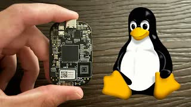

In this video, I review BeagleBoard’s PocketBeagle 2, a compact, open-source single-board computer powered by the Texas Instruments AM62x SoC.

The PocketBeagle 2 features 512MB LPDDR4 RAM, includes a microSD card slot for storage, and offers optional eMMC storage. It provides maker-friendly 72 GPIO pins with ample expandability at an affordable price. Designed for anyone who wants to learn Embedded Linux, low-level hardware development, or work on electronics and robotics projects.

Posted on YouTube: [https://youtu.be/7mwR0meClgY](https://youtu.be/7mwR0meClgY)
