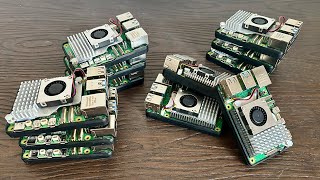

In this video, I explore creative and practical ideas for using a Raspberry Pi, including why having multiple units can unlock new possibilities. Whether you’re a beginner or a maker, learn how multiple Raspberry Pis can power projects like home servers, clusters, IoT setups, and more.

Posted on YouTube: [https://youtu.be/flm1QWlHYn8](https://youtu.be/flm1QWlHYn8) \
Featured GitHub Repo: https://github.com/ryderhutchings/pi-have-no-idea