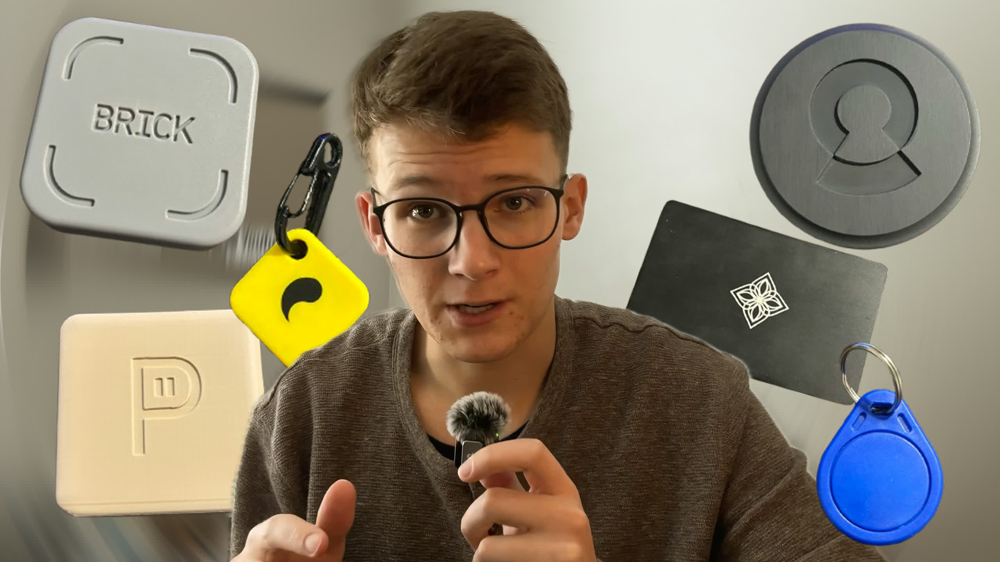
Posted on YouTube: [https://youtu.be/xEhw_81hB08](https://youtu.be/xEhw_81hB08)
# TL;DR

For many of you, this article might be somewhat overstimulating and hard to read because I may have added too much fluff (and by that I mean there are a lot of images and GIFs). But the takeaway consensus I want you to have is that I believe everyone should have some sort of device like this to help with screen time.

**Disclosure:** Some of the following products were provided for the purpose of this video and review; however, all thoughts and opinions are my own, and no money was exchanged during the making of this video.

---

<link rel="stylesheet" href="https://cdnjs.cloudflare.com/ajax/libs/font-awesome/4.7.0/css/font-awesome.min.css">

| Tool      | Account Required | Price           | Available Platforms         | Emergency Unblock | My Rating |
|:---------:|:----------------:|:---------------:|:---------------------------:|:----------------:|:--------:|
| Brick     | ✅               | $59             | iOS / Android              | Yes               | 4 / 5  |
| PauseBox  | ❌               | $24.95          | iOS (Android coming soon)  | Yes               | 5 / 5  |
| Locked    | ❌               | $44             | iOS                        | Yes               | 5 / 5  |
| Unpluq    | ✅               | $66/yr     | iOS / Android              | Yes               | 3 / 5  |
| Bloom     | ✅               | $39             | iOS / Android              | Yes               | 3 / 5  |
| Foqos     | ❌               | Free            | iOS                        | Yes               | 4 / 5  |

---
<!--
Red  
Green  
Orange  
-->

## Brick
**Account Required:** Yes  
**Price:** $59  
**Available Platforms (iOS / Android):**  Both  
**Website:** [https://getbrick.com/](https://getbrick.com/)  
**Physical Device Needed:** Yes  

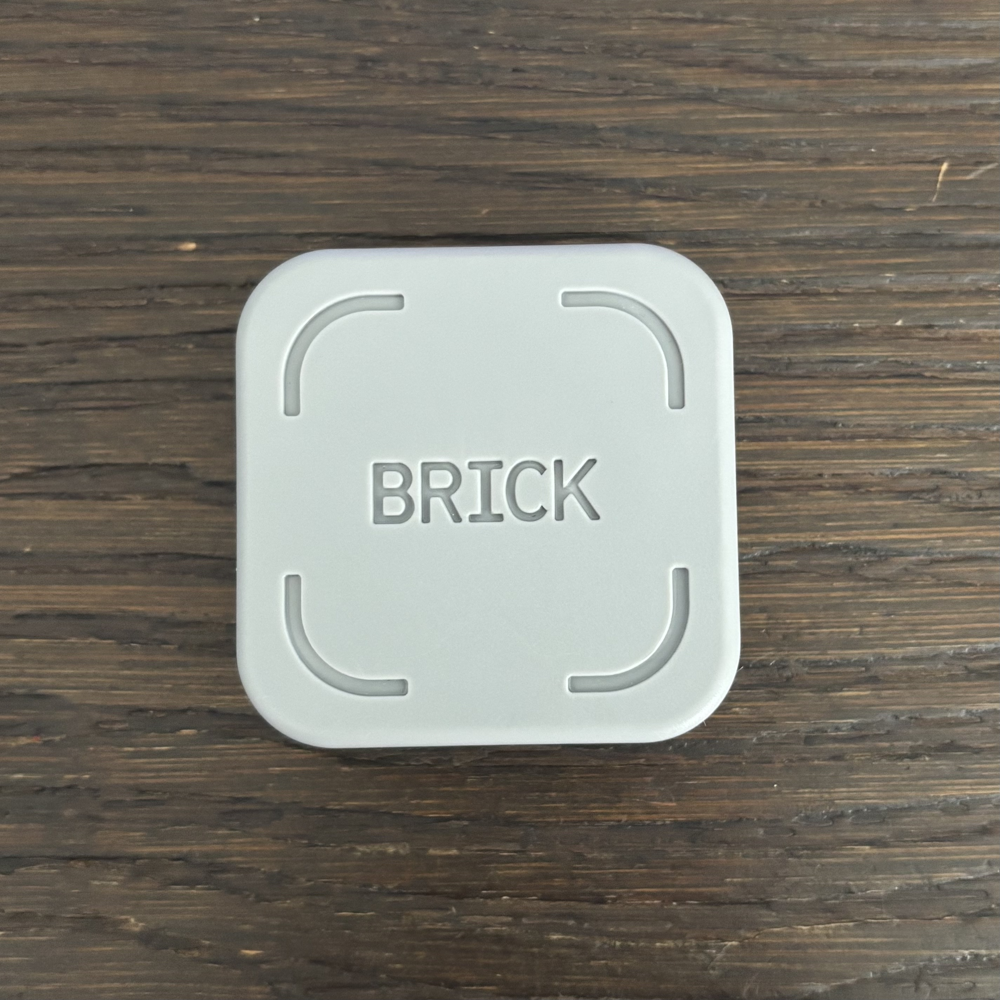

**Emergency Unblock / Unlocks**
- Available: Yes, you get 5 emergency unbricks/unblocks, which can be reset by contacting support (see: https://getbrick.com/pages/emergency-unbricks).

### How It Works
- **App is gray / dark** → Bricked Mode is **ON**, apps you select will be blocked.

- **App is white / light** → Bricked Mode is **OFF**, all apps work normally.

- To toggle **Bricked / Unbricked Mode** → Tap the **Brick logo** in the app, then **tap your phone to the Brick device** to turn bricked mode on or off.

  
  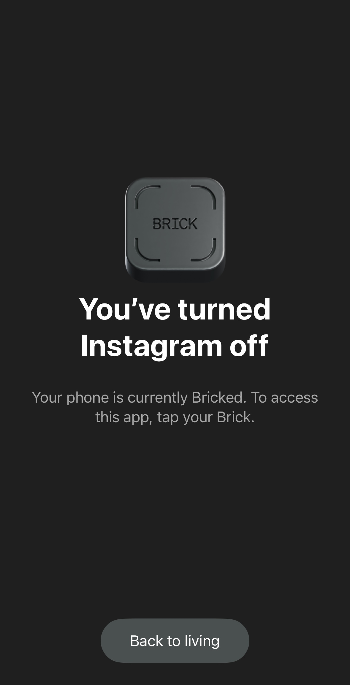
  

    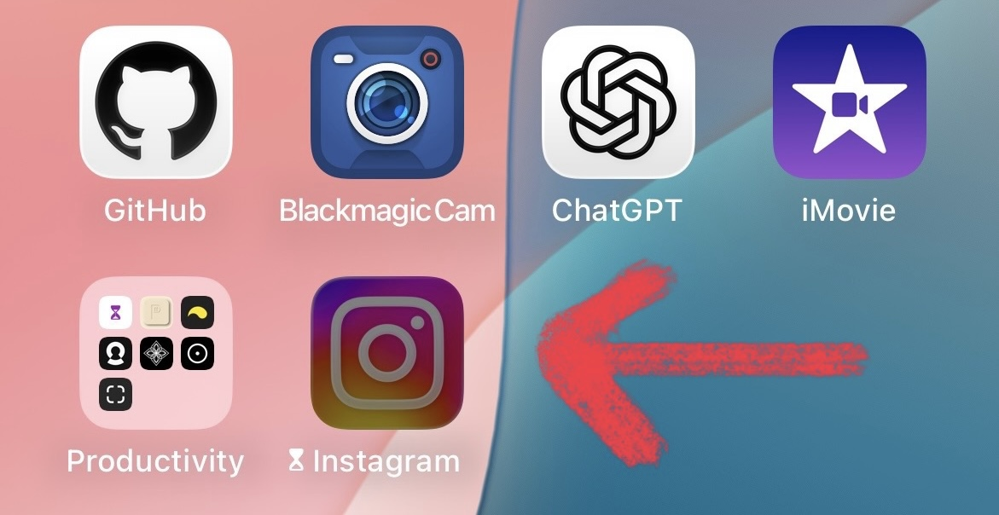
  

### Pros
- Physical device to enforce app limits and screen time (no one-click workarounds).
- Premium-looking and feeling device.
- Clean, intuitive, and easy-to-use app UI (extremely user friendly).
- Selective app blocking (block only what you want).
- Emergency unblock/unlock option available if needed.
- Works on both iOS and Android.
- Works offline, no internet required.
- The app is constantly being updated and new features added.
- Brick is available for a one-time cost, providing lifetime access after purchase.

### Cons
- You must have the physical Brick to unlock your phone. If you’re away from it, you cannot access your apps without using limited emergency unlocks. These can be reset, but the process takes time (see: https://getbrick.com/pages/emergency-unbricks).  
- $59 price for the device.
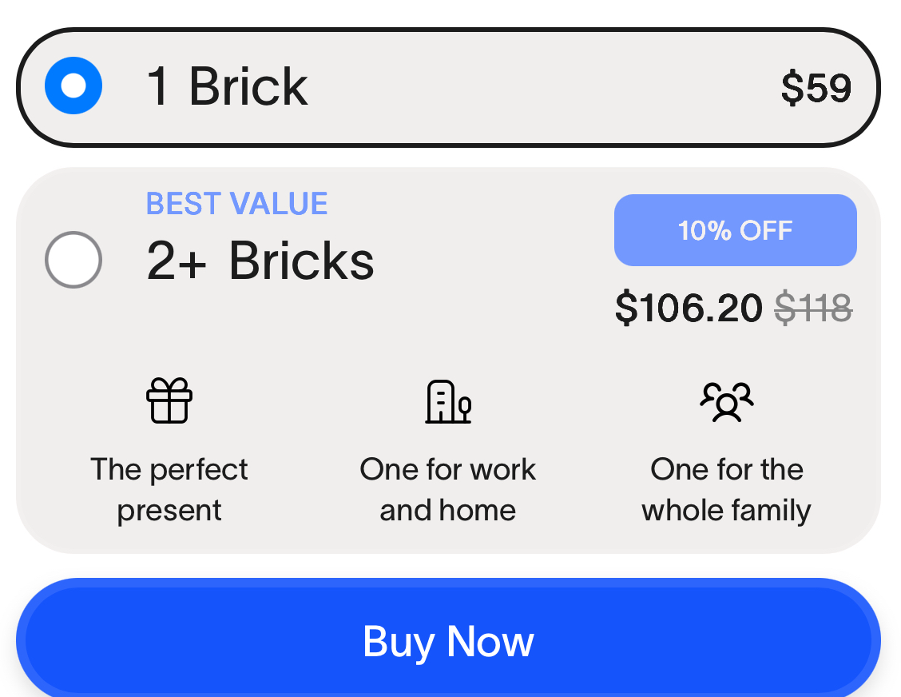
- Requires creating an account, and some data is collected*, including:  
  - Identifiers, such as your name and email address  
  - Contact information, such as your phone number  
  *(See: https://getbrick.com/pages/privacy-policy)  
- It’s not perfect; some users have reported issues on Android.

<!DOCTYPE html>
<html>
<head>
<!-- Font Awesome Icon Library -->
<link rel="stylesheet" href="https://cdnjs.cloudflare.com/ajax/libs/font-awesome/4.7.0/css/font-awesome.min.css">

</head>
<body>

<h2>Here's What I Think About Brick</h2>
Rating:

  

I think Brick is an interesting company, and the idea behind the product is solid. After using Brick for some time now, I would definitely recommend it to a friend. However, the price is kind of steep, It's hard to justify spending $59 USD on something that likely costs only a dollar or two to make, considering the components are probably just an injection-molded shell, an NFC sticker, a magnet, and a rubber bottom, all of which could likely be assembled for around $5.(which is likely a generous estimate, considering Brick is probably made in bulk to reduce manufacturing costs).  

At the end of the day, from a business perspective, you’ve got to make your money somehow—just be glad Brick is not a subscription.

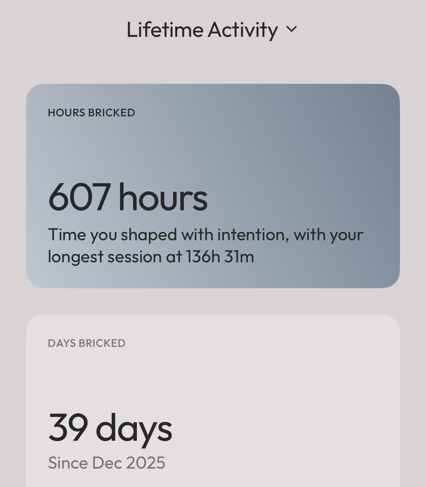

I think what you are really paying for with the $59 USD is the software: the app UI is very user-friendly, and the app consistently receives updates. After trying other products from different companies that do the same thing, I find it hard to say Brick is my number one recommendation; however, it is definitely up there. I like the product and the app, and if someone from the Brick team is reading this, keep up the good work and also consider lowering your cost.

</body>
</html>
  

---

## PauseBox
**Account Required:** No (all data is stored locally).  
**Price:** $24.95 
**Available Platforms (iOS / Android):** iOS (Android support coming soon)  
**Website:** [https://getpausebox.com/](https://getpausebox.com/)  
**Physical Device Needed:** Yes

  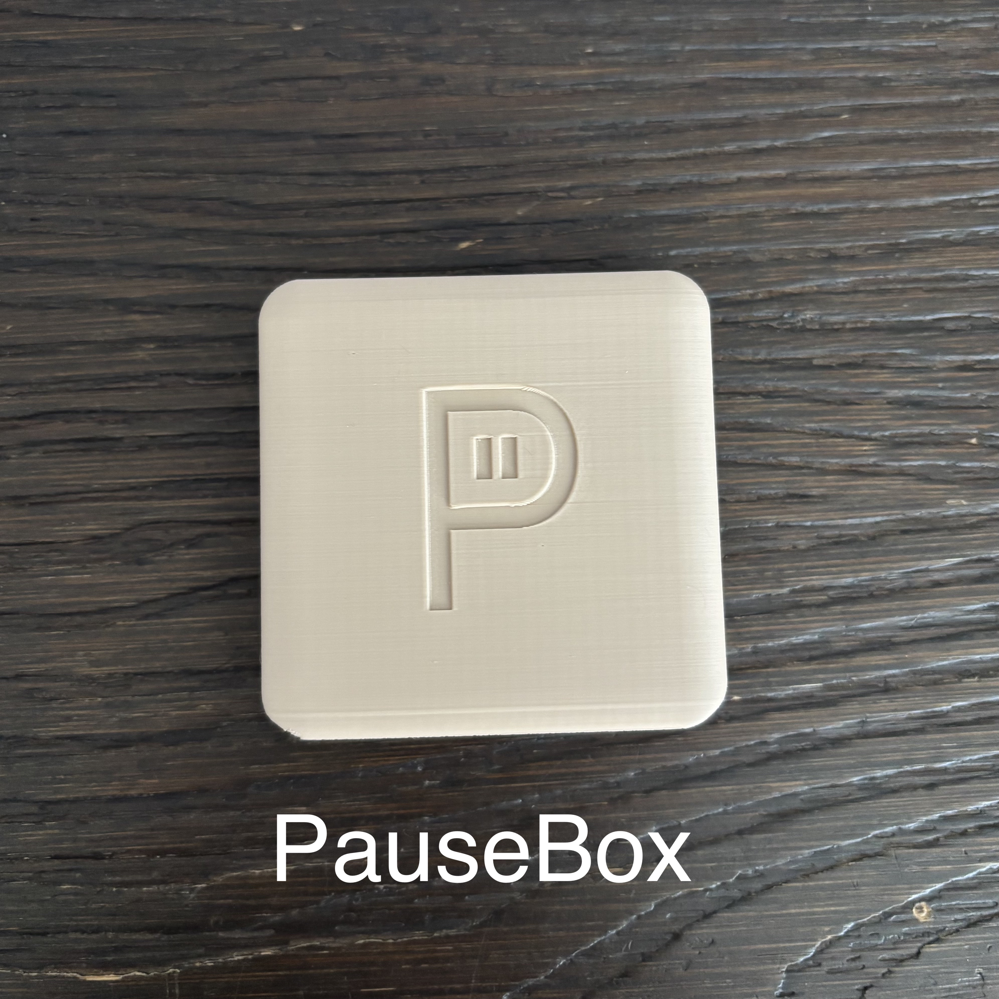
  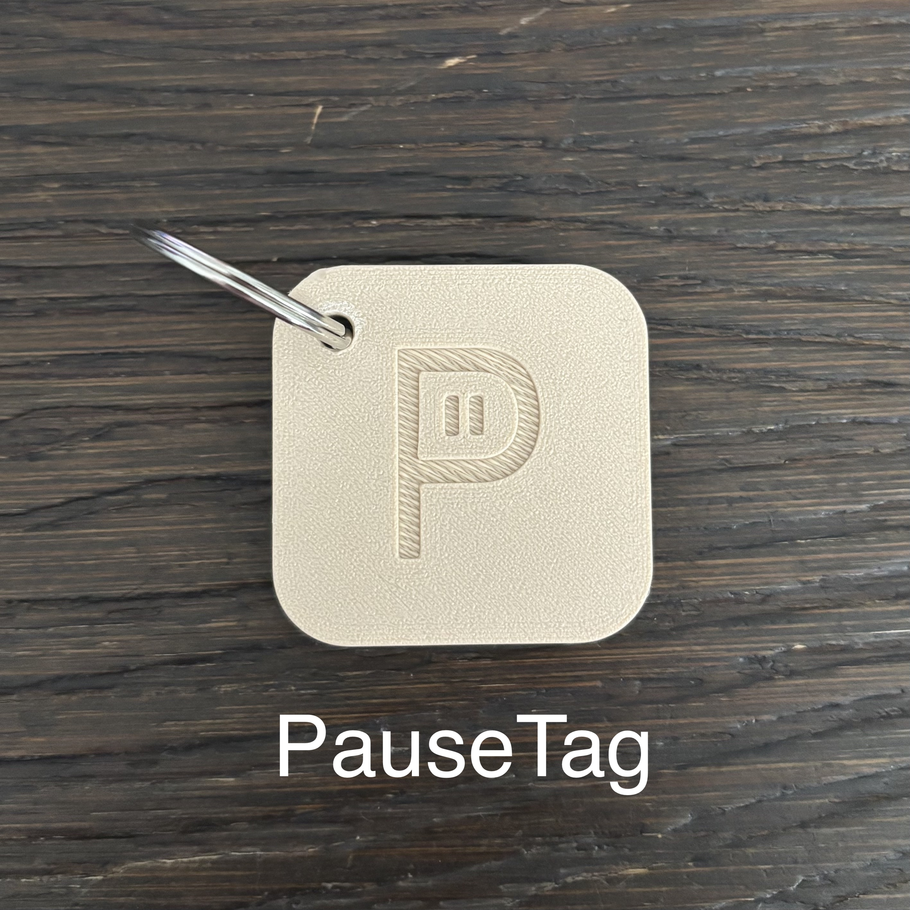

**Emergency Unblock / Unlocks**
- Available: Infinite (To the best of my knowledge, I’ve used *Emergency Shut Off* several times and haven’t found any signs of a limit. I think that typing all of the text out is punishment enough.)

### How It Works
- **App is beige / cream color** → Pause Session is **OFF**, all apps work normally.

- **App is salmon / pink color** → Pause Session is **ON**, apps you select will be blocked.

- To toggle **Pause Session ON / OFF** → Tap the **PauseBox logo** in the app, then **tap your phone to the PauseBox device (PauseBox or PauseTag)** to turn Pause Session on or off.

  
  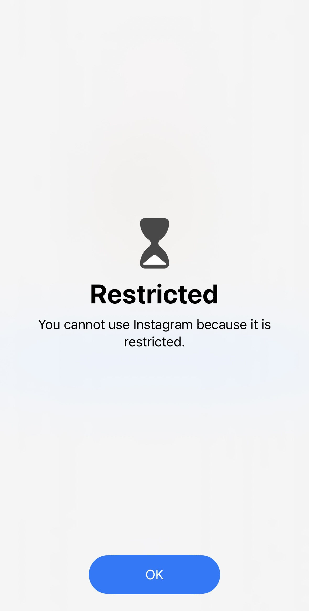
  

    
  

### Pros
- Affordable the PauseBox only costs ~~$34.95 USD~~ $24.95 USD!   And PauseTag ~~$19.99 USD~~ $14.99 USD (both are currently on sale as of this writing).
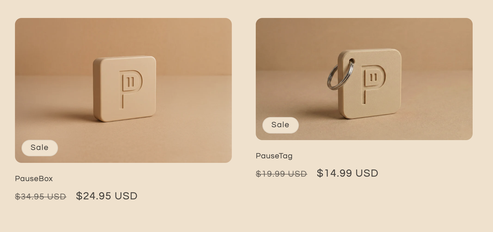
- Physical device to enforce app limits and screen time (no one-click workarounds).  
- Intuitive and easy-to-use app UI (very user-friendly).  
- Selective app blocking, including websites (block only what you want).  
- Emergency unblock/unlock option available if needed.  
- Emergency unblock/unlocks requires some effort to maintain friction; you can’t easily bypass the control you’ve put in place.  
- Works offline, and no account creation is required during setup.  
- PauseBox does not collect any data from you.  
- The app is constantly updated with new features.  
- PauseBox / PauseTag is available for a one-time cost, providing lifetime access after purchase.  
- When you buy a PauseBox or PauseTag, you not only get a useful tool but also support a small business.

### Cons
- Emergency unblock/unlock method (called “Emergency Shut Off” in the app) can be both a pro and a con, as it intentionally adds significant friction. That is a pro in my opinion, but it can also be a con to some users.
- 3D-printed exterior: PauseBox is a new startup, so the PauseBox/PauseTag is 3D printed. At first, I didn't like it, but its simplicity has grown on me. The product could still use some refining and updates (so this isn't necessarily a con, it's just something to be aware of).

<!DOCTYPE html>
<html>
<head>
<!-- Font Awesome Icon Library -->
<link rel="stylesheet" href="https://cdnjs.cloudflare.com/ajax/libs/font-awesome/4.7.0/css/font-awesome.min.css">

</head>
<body>

<h2>Here's What I Think About PauseBox</h2>
Rating:

I think PauseBox is an awesome little startup that doesn’t get the attention it deserves and is an underdog in a market full of potential. For anyone reading this who is wondering if I have a little bias toward PauseBox, I do… but hey, they use a salmon/pink color in the app, which I really like (I like pink along with purple, shades of blue, shades of green, and shades of gray), and they also have multiple variations of the same core product (PauseBox and PauseTag). This is convenient if you travel a lot—the PauseTag is useful because you can stick it with your car keys or another keychain and still have all the functionality of the PauseBox (and the same functionality as Brick but for less). The PauseBox itself is nice because you can stick it on your fridge or something, because it has a magnet on the back. PauseBox is unique in its own right.

I think PauseBox still has a long way to go in terms of product development. I have nothing strictly speaking against 3D-printed products; they’re good for early business and prototyping, but I think a safer long-term solution like injection molding would entice more consumers and get PauseBox more business.

On a completely unrelated side note, when I first put my PauseBox on my fridge, I later went to take it off and just stared blankly at this:

  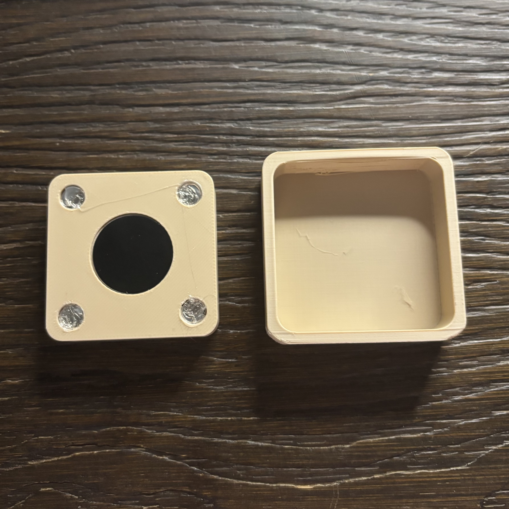
  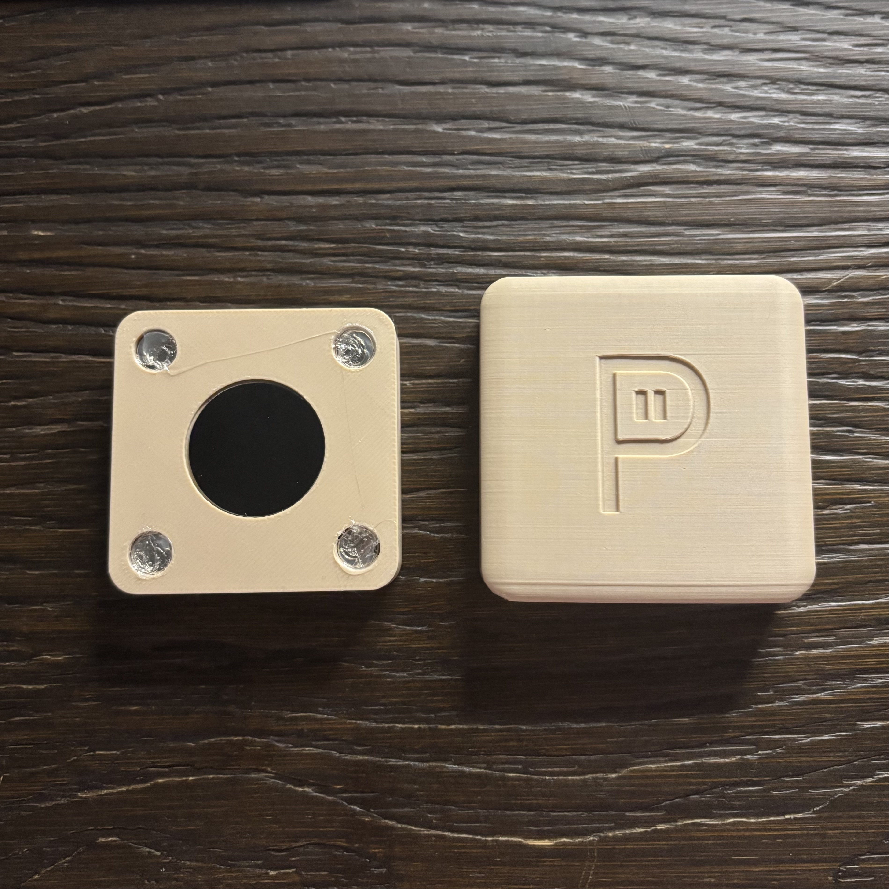
  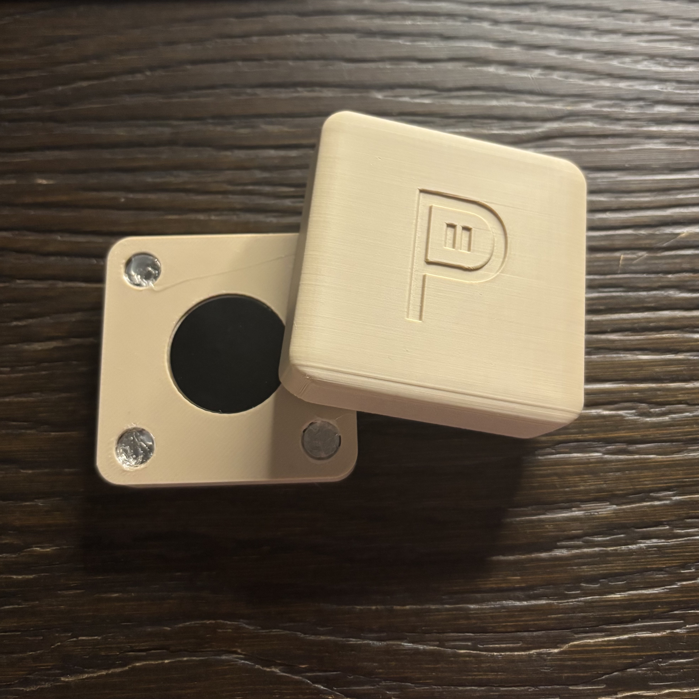
  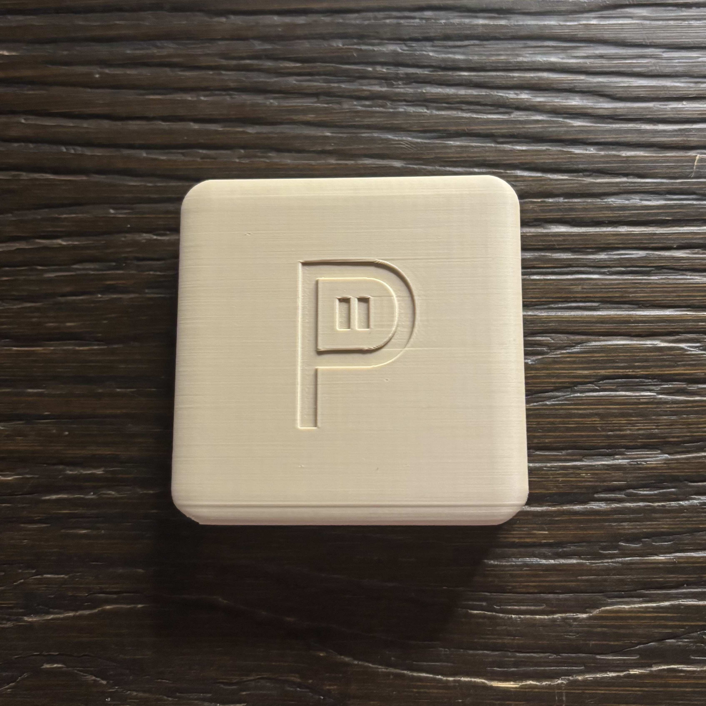

After the initial shock of it breaking, I simply found it funny. With little effort, I fixed it, and the two parts just clicked back together.

</body>
</html>
  

---

## Unpluq
**Account Required:** Yes (Google, Apple, or Email/Password).  
**Price:** $79.00 (includes 1 Year Unpluq Premium + Unpluq Tag; $66 per year after) 
**Available Platforms (iOS / Android):** Both  
**Website:** [https://www.unpluq.com/](https://www.unpluq.com/)  
**Physical Device Needed:** No  

  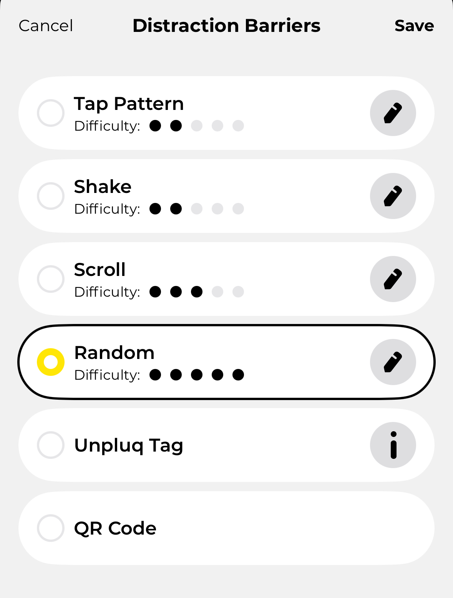
  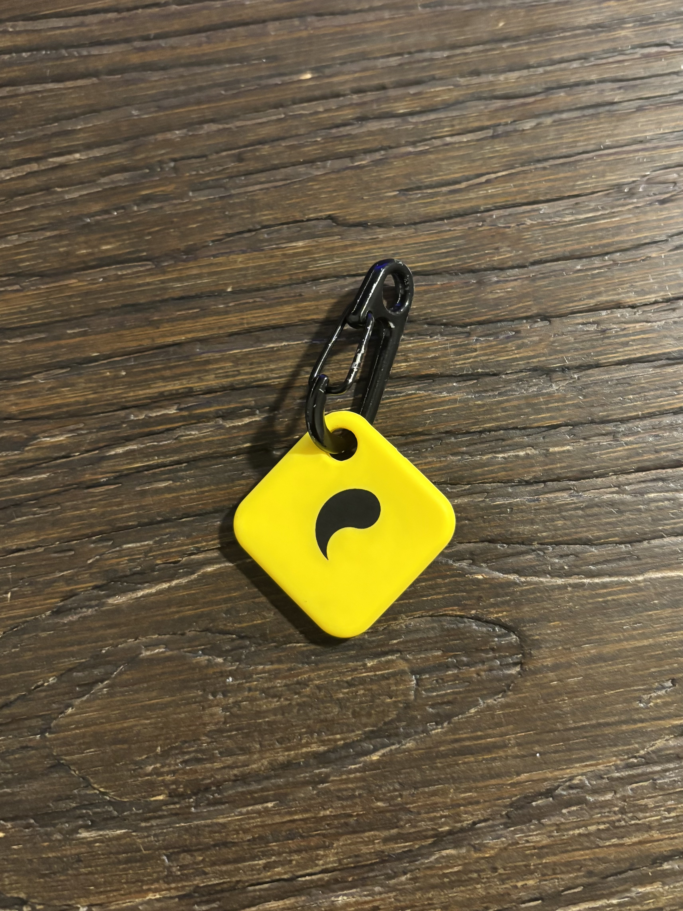

**Emergency Unblock**
- Available: Yes, you get one 5-minute emergency break per day. During this time, you can disable the blocking schedule, and all apps work normally. 

### How It Works
- **When you start a Blocking Schedule, Blocking Mode is enabled immediately.**
Nothing else is required to begin blocking. No physical device interaction is needed. Simply turning the schedule on activates blocking the apps you have selected to block.

- **In Schedules, create or enable your Blocking Schedule**
If the toggle box is **grey**, the schedule is **OFF** and all apps work normally.
If the toggle box is **yellow**, the schedule is **ON** and your selected apps will be blocked.

  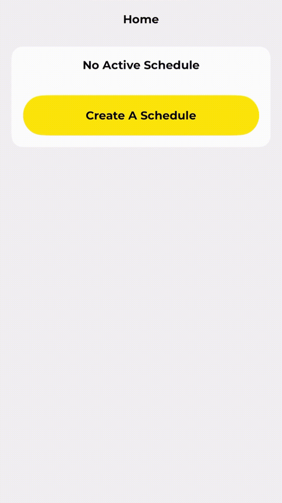
  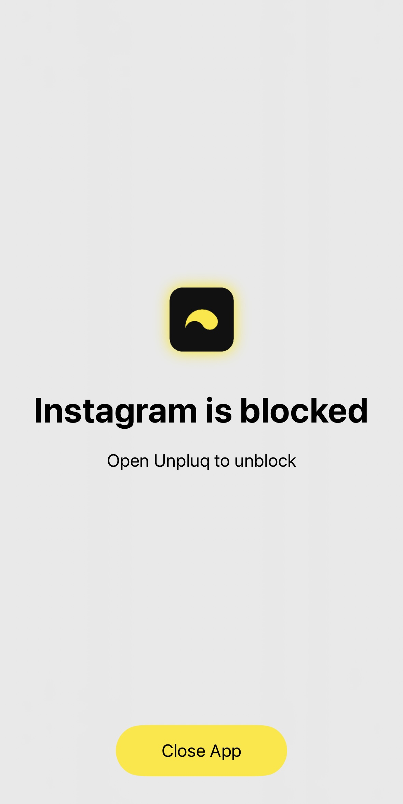
  

    
  

 

### Pros
- Physical device available to enforce app limits and screen time with no simple one-click workarounds.
- Multiple unblocking "Distraction Barriers" available, so a hardware purchase is not required. An optional Unpluq-branded NFC device called the "Unpluq Tag" is also available for purchase.
- Clean, intuitive, and easy-to-use app UI (user interface).
- Selective app blocking so you can block only the apps you choose.
- Emergency unblock option available when needed.
- Works on both iOS and Android.
- Frequently updated with new features and improvements.

### Cons
- Unpluq requires a subscription, which you can purchase for 6 months, 1 year, or 3 years. There is no one-time purchase or lifetime access option.
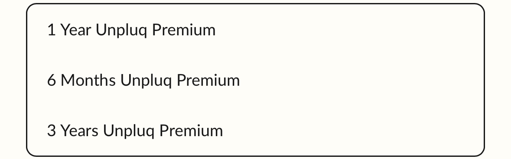
- The app UI, while user-friendly in some respects, I find extremely confusing and cluttered. (Unpluq, please consider merging the Home page with the Schedules page).  
- Pricing: I understand that businesses need to generate revenue, but Unpluq operates on a subscription-based model, which I personally do not like. Paying $66.00 per year for a mobile app, especially in this day and age, is absurd.
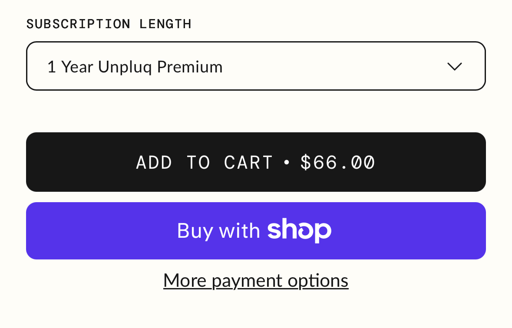
- Requires an account and collects personal information and app data*  
(See: https://www.unpluq.com/pages/privacy). *The app provides more detailed information about optional data collection than the website.

  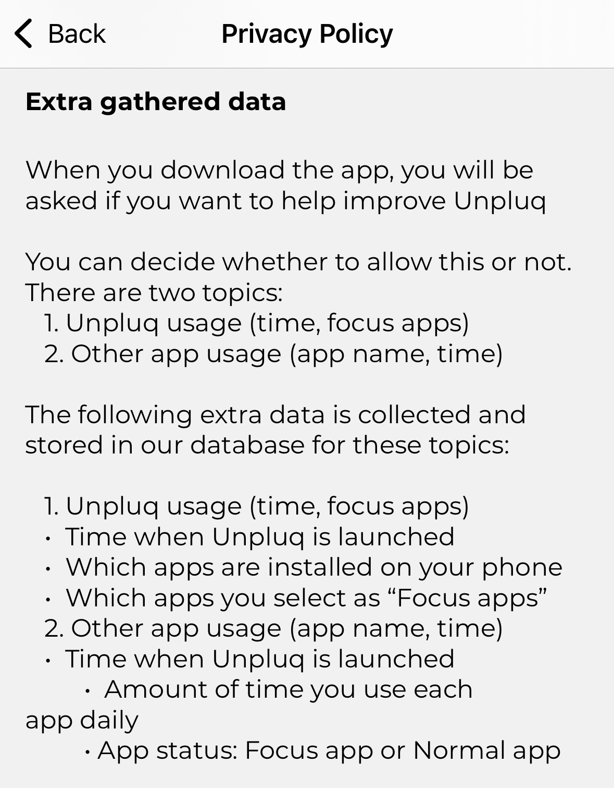
  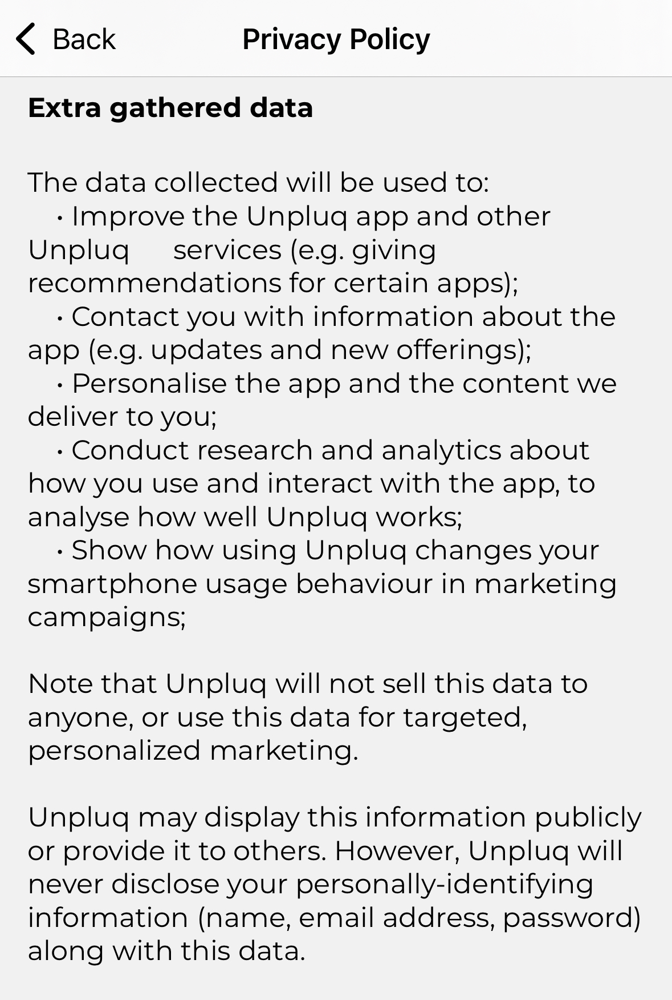

<!DOCTYPE html>
<html>
<head>
<!-- Font Awesome Icon Library -->
<link rel="stylesheet" href="https://cdnjs.cloudflare.com/ajax/libs/font-awesome/4.7.0/css/font-awesome.min.css">

</head>
<body>

<h2>Here's What I Think About Unpluq</h2>
Rating:

  

I think Unpluq overall is a good company. I see the vision and believe in it. I love the app and its features—especially the feature where there are multiple "Distraction Barriers," so you can choose how strictly you want to restrict yourself from accessing the apps you want to block. I also like how the team at Unpluq HQ cares about the app and updates it constantly, adding new features and fixing bugs. However, I disagree with the decision to run their business model as a subscription. This is my main criticism and the reason I would not recommend Unpluq to a friend. I think paying $66 per year is absurd, and I personally would never pay that much for this app after trying it. Even if Unpluq were $19.99 per year, I still would not pay for a subscription to an app.

This is not strictly against Unpluq—I just hate subscription-based models and do not support businesses or products that use them. We are headed in a direction where businesses and corporate brands push the idea that "you will own nothing and be happy," where you have to pay a subscription to use your [printer or buy printer ink through a subscription plan for a device you already purchased](https://www.hp.com/us-en/all-in-plan/printers.html). In some cases, you are essentially paying just to print on paper—even though you already bought the printer. You also see outlandish prices for streaming platforms while DVDs and physical media are being phased out and no longer sold. We are now living in a world where pirating (which is illegal) has become increasingly common because of the mindset that "if buying isn't owning, pirating isn't stealing." But I am getting ahead of myself and going off topic.

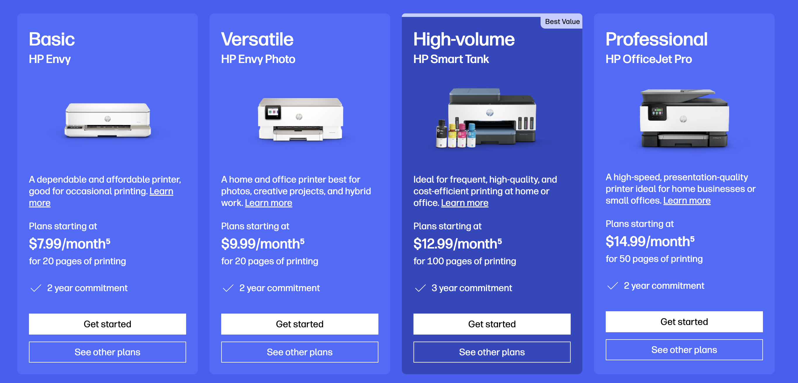

If it were not for the subscription-based model Unpluq uses and what I consider excessive pricing, I would rank Unpluq in my top three recommendations. At the end of the day, I understand that from a business perspective, Unpluq needs to generate revenue somehow. However, contributing to what is a much larger global shift toward subscription-only access is what ultimately withdraws my support and dampens my otherwise positive outlook on the company.

Lastly, I want to reiterate that I am not saying Unpluq is a bad company. I genuinely like the service and the idea behind it. I simply do not support subscription-based business models. If you have been wanting to use Unpluq or are comfortable spending $66 per year, by all means, do so. Unpluq is a solid product, and I am not trying to speak negatively about it.

My 3 out of 5 star rating may seem harsh, but it is not a reflection of the product or service itself—it is solely based on the business model. If I were rating the product while ignoring the subscription model, my true rating would be 4 out of 5. Keep up the good work, Unpluq, and consider reevaluating the business model to avoid contributing to what is abroader industry issue.

</body>
</html>
  

---

## Locked
**Account Required:** No (all data is stored locally).  
**Price:** $44  
**Available Platforms (iOS / Android):** iOS   
**Website:** [https://nowlocked.com/](https://nowlocked.com/)  
**Physical Device Needed:** Yes 

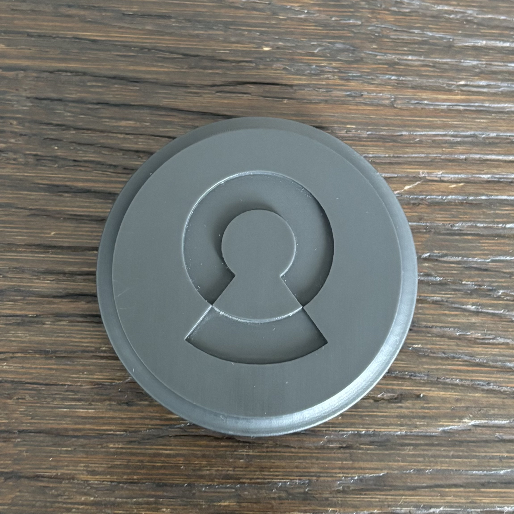

**Emergency Unblock**
- Yes, you have 3 Emergency Unlocks every 29 days, and they reset automatically.

### How It Works
- **When you click "Start a Focus Session"** → Choose a profile (with the apps you want to block) and then scan your phone on the **Locked® tag**; the selected apps will be blocked.

- **When you click "End Focus Session"** → Scan your phone on the **Locked® tag**, and all apps will function normally.

  
  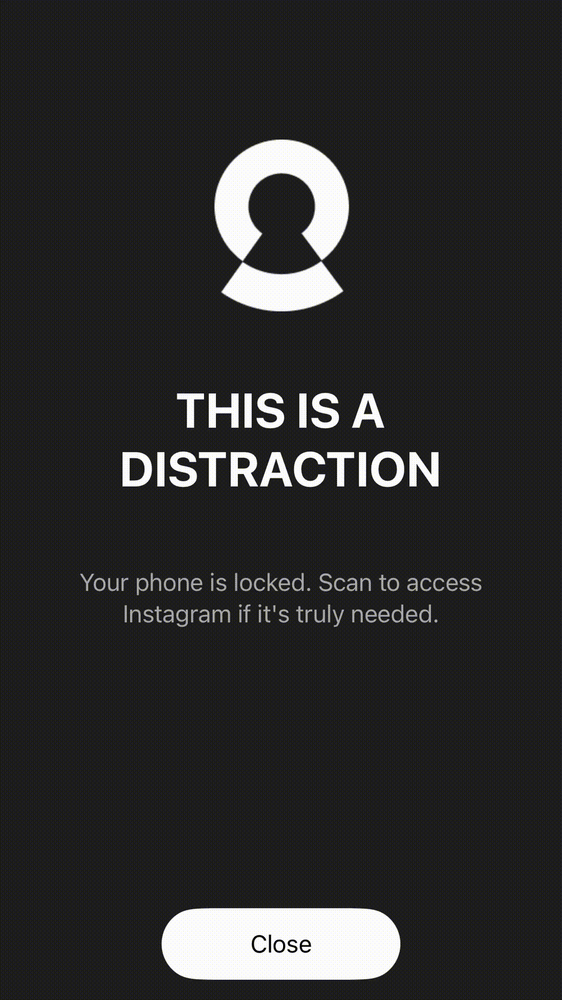
  

    
  

 

### Pros
- Physical device to enforce app limits and screen time (no one-click workarounds).  
- Intuitive and easy-to-use app UI (very user-friendly).  
- Selective app blocking, including websites (block only what you want).  
- Emergency unblock/unlock option available if needed.  
- Works offline, and no account creation is required during setup.  
- Locked does not collect any data from you.  
- The app is constantly updated with new features.  
- Locked is available for a one-time cost, providing lifetime access after purchase.
- When you buy a Locked® tag you not only get a useful tool but also support a small business.
- Has fun blocking messages; you can choose from Stoic thoughts or Pop Culture.

### Cons
- 3D-printed exterior: Locked is a new startup, so the Locked® tag is 3D-printed. The print quality is so high that I initially thought it was made of wood (so this isn’t necessarily a con, just something to be aware of).
- The app works well but could benefit from additional polish, particularly with a potential UI and UX refresh.

<!DOCTYPE html>
<html>
<head>
<!-- Font Awesome Icon Library -->
<link rel="stylesheet" href="https://cdnjs.cloudflare.com/ajax/libs/font-awesome/4.7.0/css/font-awesome.min.css">

</head>
<body>

<h2>Here's What I Think About Locked</h2>
Rating:

  

I think Locked is a great company, and I genuinely like the product. The Locked tag has a unique design approach and is round, similar to a hockey puck. The app is simple and easy to use, and I appreciate that it offers different locking screens and blocking styles.

That said, the simplicity may be a bit too minimal. The UX/UI could benefit from a refresh to feel more modern and polished. It would also be nice to have the ability to change the app’s theme for more personalization. Additionally, I would enjoy seeing more Pop Culture references in the blocking messages, and a playful “roast” mode could make the experience even more engaging.

Overall, I do not have anything really negative to say, just a few ideas that could make an already solid product even better. At $44, the price is on the higher end for this type of product, similar to how I consider Brick to be expensive.
</body>
</html>
  

---

## Bloom
**Account Required:** Yes (Email/Password)  
**Price:** $39  
**Available Platforms (iOS / Android):** Both  
**Website:** [https://bloom.inc/](https://bloom.inc/)  
**Physical Device Needed:** Yes  

**Emergency Unblock**
- Available: Yes. You receive three emergency unblocks by default, and one additional unblock is added every 30 days.
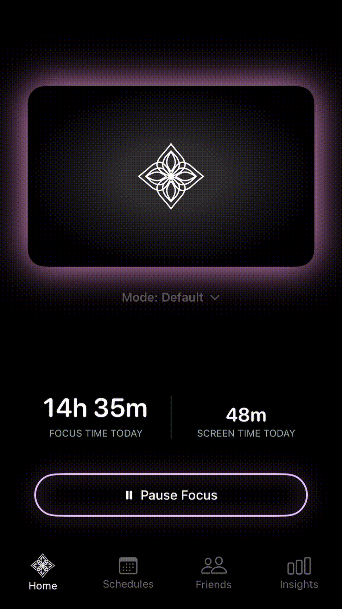

### How It Works

  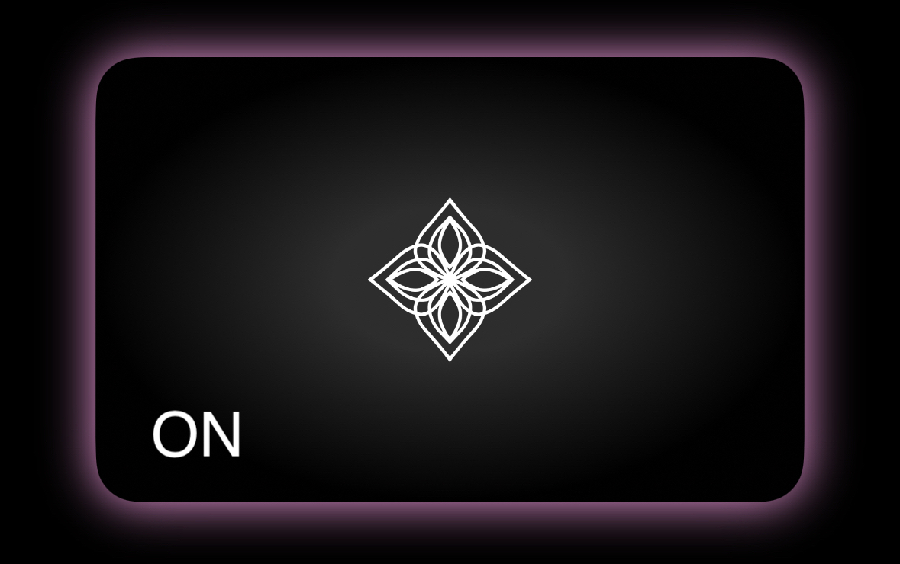
  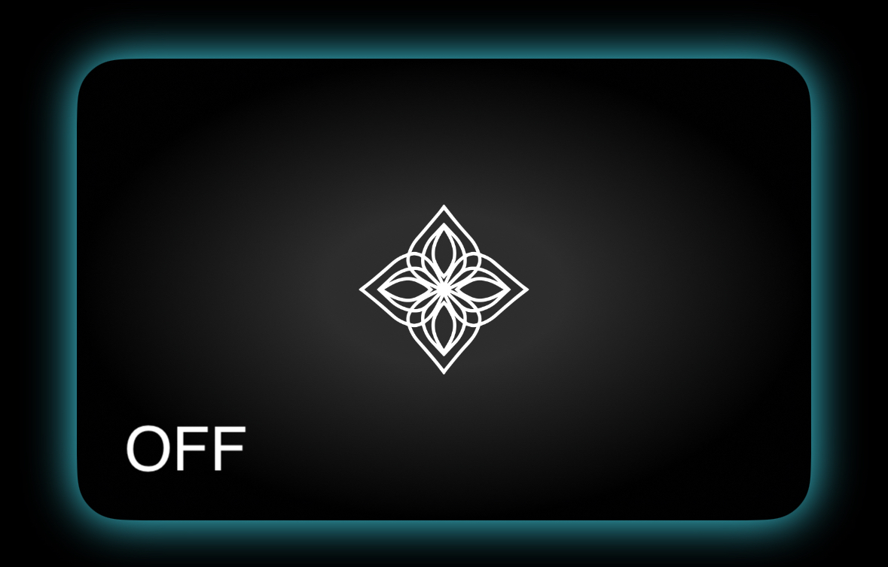

- **When the Bloom logo is black with a purple outline** → Focus Session is **ON**, apps you select will be blocked.

- **When the Bloom logo is black with a blue outline** → Focus Session is **OFF**, all apps work normally.

- To toggle **Focus Session ON / OFF** → Tap the **Bloom logo** in the app, then **tap your phone to the Bloom Card** to turn Focus Session on or off.

  
  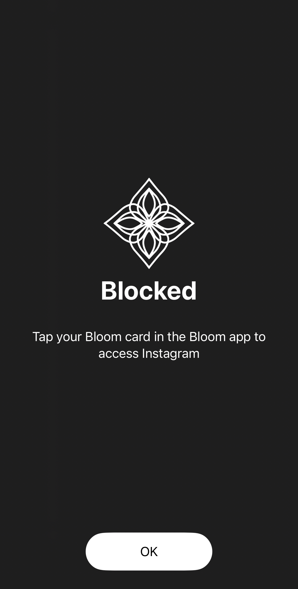
  

    
  

 

### Pros
- Physical device to enforce app limits and screen time (no one-click workarounds).
- Bloom is available for a one-time cost, providing lifetime access after purchase.
- Premium-looking and durable metal device.
- Clean, intuitive, and easy-to-use app UI.
- Selective app blocking (block only what you want).
- Emergency unblock/unlock option available if needed.
- Works on both iOS and Android.
- The app is constantly updated with new features.
- Includes a competitive, time-based leaderboard for how long you’ve stayed focused.

### Cons
- The UI/UX can feel cluttered and somewhat overwhelming (it could be simplified).
- Encourages taking breaks rather than maintaining extended focus sessions.
- Requires an account and collects personal information and app data.*  
  (See: [Privacy Policy](https://www.termsfeed.com/live/f02a9b1a-591f-43a0-a0ad-10509b957a64))
- While $39 is on the more affordable end of the spectrum for this type of device, it is, in my opinion, still overpriced for what you are getting.

<!DOCTYPE html>
<html>
<head>
<!-- Font Awesome Icon Library -->
<link rel="stylesheet" href="https://cdnjs.cloudflare.com/ajax/libs/font-awesome/4.7.0/css/font-awesome.min.css">

</head>
<body>

<h2>Here's What I Think About Bloom</h2>
Rating:

  

I think the idea behind Bloom is solid, and I understand the appeal of having a physical barrier to reduce distractions. The metal card is an interesting implementation of this concept and gives the product a more premium feel.

That said, I am not a fan of the pricing. While I understand from a business perspective that companies need to make money, $39 feels high for what you are getting. The app also feels cluttered and somewhat messy in its current design. I personally do not like that Bloom encourages taking breaks rather than maintaining extended focus sessions, as that does not align with how I think a focus tool should be structured.

Overall, while the concept is strong, the pricing and app experience make it less appealing to me.
</body>
</html>

---

## Foqos
**Account Required:** No  
**Price:** Free  
**Available Platforms (iOS / Android):** iOS  
**Physical Device Needed:** No (but it works best with an NFC device)  

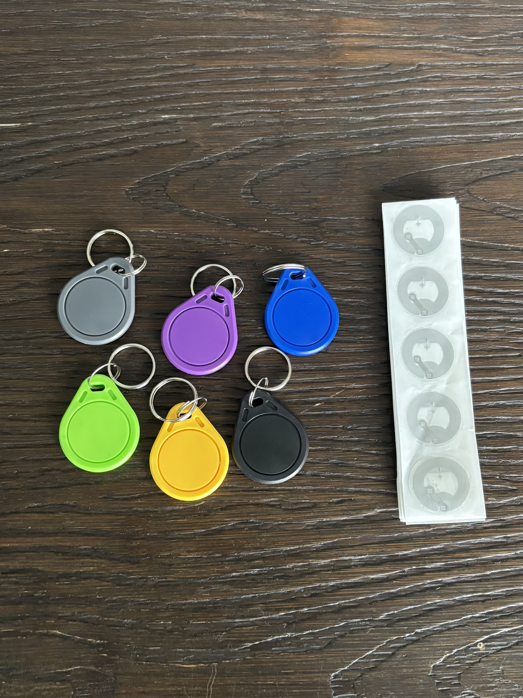

**Emergency Unblock**
- Available: Yes, you get 3 Emergency Access Unblocks, which reset every 2 weeks (for extra friction, this can be changed to reset up to every 8 weeks).

### How It Works
- **When you click "Hold to Start"** → The Focus Session turns **ON**, and the apps you selected will be blocked.

- **When you click "Stop"** → The Focus Session turns **OFF**, and all apps return to normal.

  
  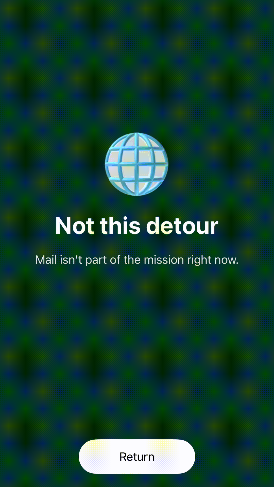
  

    
  

 

### Pros
- Foqos is free, providing lifetime access without a purchase.
- No account creation is required during setup or at all to use the app!
- Foqos is open source, and you can contribute to the app!
- The app is highly customizable.
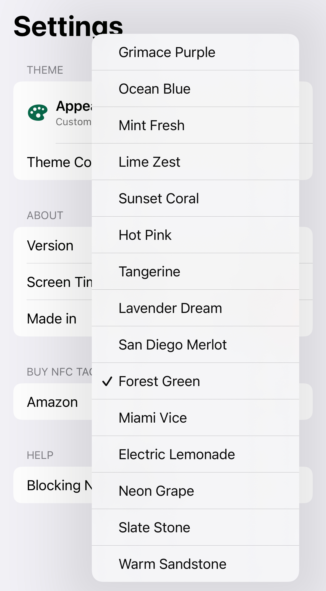

### Cons
- The main con would be that the app doesn't feel super polished, but in this case I am actually fine with that because this UI/UX is customizable compared to competitors.
- Only works on iOS (also known as iPhones).

<!DOCTYPE html>
<html>
<head>
<!-- Font Awesome Icon Library -->
<link rel="stylesheet" href="https://cdnjs.cloudflare.com/ajax/libs/font-awesome/4.7.0/css/font-awesome.min.css">

</head>
<body>

<h2>Here's What I Think About Foqos</h2>
Rating:

  

Insert what I think here... about Foqos
</body>
</html>
  

---

## Final Thoughts

I think that everyone should have some sort of device like this in today's day and age, especially in 2026, to help with our constantly online state and dopamine-addicted brains.
