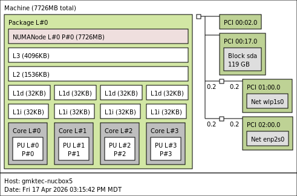
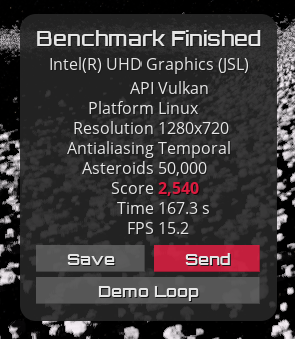
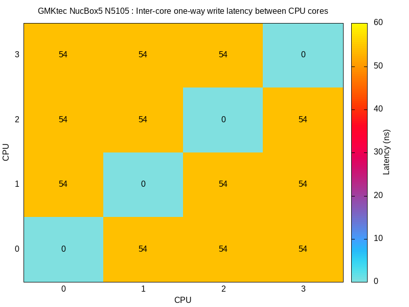

Posted on YouTube (1-year update): [https://youtu.be/3xebrmU7vVk](https://youtu.be/3xebrmU7vVk)

>[!TIP]
> Update (Apr 2026): It’s now been over two years, and it’s still running reliably. Power efficiency remains excellent, but the Celeron N5105 is starting to show its age for heavier workloads.

## Basic Information:

  - Mfr. URL (official): [https://www.gmktec.com/](https://www.gmktec.com/products/intel-11th-jasper-lake-n5105-mini-pc-windows-11-pro?)
  - PC purchased from: Amazon
  - PC purchase date: October 22, 2023
  - PC specs (as tested): 8GB RAM + 128GB SSD
  - PC price (as tested): $127.19

## Linux/System Information:

```
# output of `screenfetch`
         _,met$$$$$gg.           ryderhutchings@gmktec-nucbox5
      ,g$$$$$$$$$$$$$$$P.        OS: Debian 13 trixie
    ,g$$P""       """Y$$.".      Kernel: x86_64 Linux 6.12.74+deb13+1-amd64
   ,$$P'              `$$$.      Uptime: 57m
  ',$$P       ,ggs.     `$$b:    Packages: 1411
  `d$$'     ,$P"'   .    $$$     Shell: bash 5.2.37
   $$P      d$'     ,    $$P     Disk: 4.1G / 115G (4%)
   $$:      $$.   -    ,d$$'     CPU: Intel Celeron N5105 @ 4x 2.9GHz [35.0°C]
   $$\;      Y$b._   _,d$P'      GPU: UHD Graphics
   Y$$.    `.`"Y$$$$P"'          RAM: 680MiB / 7725MiB
   `$$b      "-.__              
    `Y$$                        
     `Y$$.                      
       `$$b.                    
         `Y$$b.                 
            `"Y$b._             
                `""""           

# output of `uname -a`
Linux gmktec-nucbox5 6.12.74+deb13+1-amd64 #1 SMP PREEMPT_DYNAMIC Debian 6.12.74-2 (2026-03-08) x86_64 GNU/Linux

```
## System Topology:

 \
Note: lstopo results may be missing some information on new and strange SoCs.

## Benchmark Results:

### CPU

>[!NOTE]
> Performance is in line with low-end modern CPUs, fine for general use, but slow for sustained or heavier workloads.

#### `Geekbench 6` results: 
- See: [https://browser.geekbench.com/v6/cpu/17683434](https://browser.geekbench.com/v6/cpu/17683434) and [https://browser.geekbench.com/v6/cpu/17683608](https://browser.geekbench.com/v6/cpu/17683608)
- 555 Single-Core Score / 1635 Multi-Core Score

#### `top500-benchmark` results:

- See: [geerlingguy/top500-benchmark](https://github.com/geerlingguy/top500-benchmark)

- 22.911 Gflops at 16.5W, for ~1.389 Gflops/W
<details>
<summary>Click to expand HPLinpack / top500-benchmark results</summary>

```
        ================================================================================
        HPLinpack 2.3  --  High-Performance Linpack benchmark  --   December 2, 2018
        Written by A. Petitet and R. Clint Whaley,  Innovative Computing Laboratory, UTK
        Modified by Piotr Luszczek, Innovative Computing Laboratory, UTK
        Modified by Julien Langou, University of Colorado Denver
        ================================================================================

        An explanation of the input/output parameters follows:
        T/V    : Wall time / encoded variant.
        N      : The order of the coefficient matrix A.
        NB     : The partitioning blocking factor.
        P      : The number of process rows.
        Q      : The number of process columns.
        Time   : Time in seconds to solve the linear system.
        Gflops : Rate of execution for solving the linear system.

        The following parameter values will be used:

        N      :   23314
        NB     :     256
        PMAP   : Row-major process mapping
        P      :       1
        Q      :       4
        PFACT  :   Right
        NBMIN  :       4
        NDIV   :       2
        RFACT  :   Crout
        BCAST  :  1ringM
        DEPTH  :       1
        SWAP   : Mix (threshold = 64)
        L1     : transposed form
        U      : transposed form
        EQUIL  : yes
        ALIGN  : 8 double precision words

        --------------------------------------------------------------------------------

        - The matrix A is randomly generated for each test.
        - The following scaled residual check will be computed:
              ||Ax-b||_oo / ( eps * ( || x ||_oo * || A ||_oo + || b ||_oo ) * N )
        - The relative machine precision (eps) is taken to be               1.110223e-16
        - Computational tests pass if scaled residuals are less than                16.0

        ================================================================================
        T/V                N    NB     P     Q               Time                 Gflops
        --------------------------------------------------------------------------------
        WR11C2R4       23314   256     1     4             368.77             2.2911e+01
        HPL_pdgesv() start time Fri Apr 17 18:18:24 2026

        HPL_pdgesv() end time   Fri Apr 17 18:24:32 2026

        --------------------------------------------------------------------------------
        ||Ax-b||_oo/(eps*(||A||_oo*||x||_oo+||b||_oo)*N)=   3.39832969e-03 ...... PASSED
        ================================================================================

        Finished      1 tests with the following results:
                      1 tests completed and passed residual checks,
                      0 tests completed and failed residual checks,
                      0 tests skipped because of illegal input values.
        --------------------------------------------------------------------------------

        End of Tests.
        ================================================================================
```
</details>

#### `sysbench` results:
- See: [akopytov/sysbench](https://github.com/akopytov/sysbench)

```
CPU speed:
    events per second:  2620.32

General statistics:
    total time:                          10.0014s
    total number of events:              26211

Latency (ms):
         min:                                    1.50
         avg:                                    1.53
         max:                                    9.53
         95th percentile:                        1.52
         sum:                                39992.22

Threads fairness:
    events (avg/stddev):           6552.7500/4.44
    execution time (avg/stddev):   9.9981/0.00
```
[comment]: # (sysbench cpu --cpu-max-prime=20000 --threads=4 run)

### Thermals
- Monitoring: `sensors` (install `lm-sensors`, run `sensors-detect` first)


[comment]: # (Let system settle 5 min before each reading. Run stress tests for 10 min minimum before recording.)

The GMKtec NucBox5 has decent thermals out of the box. Since my original 
NucBox5 video I've replaced the thermal paste with Corsair TM30.


The fan is audible under load — noticeable but not loud.

| Test Condition           | Temp (°C) | Notes |
|--------------------------|-----------|-------|
| Idle (Desktop)           | 33      | N/A |
| Web Browsing             | 44-47      | Stable, light load |
| 1080p YouTube Playback   | 48–50      | Stable, no throttling. VAAPI active |
| 4K YouTube Playback      | 47      | Stable, VAAPI active (Video engine 31%), cooler than 1080p |
| stress-ng (`--cpu 4`)    | 65      | `stress-ng --cpu 4 --timeout 600s` |
| stress-ng (`--matrix 0`) | 69      | Plateaued, stable, no throttling |
| sbc-bench run            | 64      | N/A |

### Power
  
  - Shutdown power draw (at wall): 0.4 W
  - Idle on desktop power draw (at wall): 5.7 W
  - Maximum simulated power draw (`stress-ng --matrix 0`): 15 W
  - During Geekbench multicore benchmark: 17 W
  - During `top500` HPL benchmark: 16.5 W

### Disk

>[!NOTE]
> SSD performance is adequate, but clearly budget-tier—good enough for everyday use, not heavy I/O.

#### Onboard SSD (HS-SSD-E100N42)

[comment]: # (Run `lsblk -o NAME,FSTYPE,LABEL,MOUNTPOINT,SIZE,MODEL` to get model)

| Benchmark                  | Result |
| -------------------------- | ------ |
| iozone 4K random read      | 43.7 MB/s |
| iozone 4K random write     | 119.4 MB/s |
| iozone 1M random read      | 417.5 MB/s |
| iozone 1M random write     | 375.4 MB/s |
| iozone 1M sequential read  | 435.1 MB/s |
| iozone 1M sequential write | 392.7 MB/s |


### Network

>Note: All measurements were taken over Wi-Fi, not wired Ethernet.

`iperf3` results:

  - `iperf3 -c $SERVER_IP`: 84.9 Mbps
  - `iperf3 -c $SERVER_IP --reverse`: 92.7 Mbps
  - `iperf3 -c $SERVER_IP --bidir`: 34.0 Mbps up, 66.8 Mbps down

### GPU

>[!NOTE]
> GPU is sufficient for desktop compositing and light workloads, but not suited for modern gaming.

#### `glmark2` results:

```
=======================================================
    glmark2 2023.01
=======================================================
    OpenGL Information
    GL_VENDOR:      Intel
    GL_RENDERER:    Mesa Intel(R) UHD Graphics (JSL)
    GL_VERSION:     OpenGL ES 3.2 Mesa 25.0.7-2
    Surface Config: buf=32 r=8 g=8 b=8 a=8 depth=24 stencil=0 samples=0
    Surface Size:   800x600 windowed
=======================================================
[build] use-vbo=false: FPS: 2032 FrameTime: 0.492 ms
[build] use-vbo=true: FPS: 2515 FrameTime: 0.398 ms
[texture] texture-filter=nearest: FPS: 2384 FrameTime: 0.420 ms
[texture] texture-filter=linear: FPS: 2403 FrameTime: 0.416 ms
[texture] texture-filter=mipmap: FPS: 2391 FrameTime: 0.418 ms
[shading] shading=gouraud: FPS: 2173 FrameTime: 0.460 ms
[shading] shading=blinn-phong-inf: FPS: 2173 FrameTime: 0.460 ms
[shading] shading=phong: FPS: 2048 FrameTime: 0.488 ms
[shading] shading=cel: FPS: 2015 FrameTime: 0.496 ms
[bump] bump-render=high-poly: FPS: 1456 FrameTime: 0.687 ms
[bump] bump-render=normals: FPS: 2506 FrameTime: 0.399 ms
[bump] bump-render=height: FPS: 2454 FrameTime: 0.408 ms
[effect2d] kernel=0,1,0;1,-4,1;0,1,0;: FPS: 1714 FrameTime: 0.584 ms
[effect2d] kernel=1,1,1,1,1;1,1,1,1,1;1,1,1,1,1;: FPS: 1052 FrameTime: 0.951 ms
[pulsar] light=false:quads=5:texture=false: FPS: 2246 FrameTime: 0.445 ms
[desktop] blur-radius=5:effect=blur:passes=1:separable=true:windows=4: FPS: 856 FrameTime: 1.168 ms
[desktop] effect=shadow:windows=4: FPS: 1351 FrameTime: 0.740 ms
[buffer] columns=200:interleave=false:update-dispersion=0.9:update-fraction=0.5:update-method=map: FPS: 481 FrameTime: 2.082 ms
[buffer] columns=200:interleave=false:update-dispersion=0.9:update-fraction=0.5:update-method=subdata: FPS: 724 FrameTime: 1.381 ms
[buffer] columns=200:interleave=true:update-dispersion=0.9:update-fraction=0.5:update-method=map: FPS: 465 FrameTime: 2.154 ms
[ideas] speed=duration: FPS: 1977 FrameTime: 0.506 ms
[jellyfish] <default>: FPS: 1580 FrameTime: 0.633 ms
[terrain] <default>: FPS: 213 FrameTime: 4.697 ms
[shadow] <default>: FPS: 756 FrameTime: 1.324 ms
[refract] <default>: FPS: 371 FrameTime: 2.701 ms
[conditionals] fragment-steps=0:vertex-steps=0: FPS: 2061 FrameTime: 0.485 ms
[conditionals] fragment-steps=5:vertex-steps=0: FPS: 2049 FrameTime: 0.488 ms
[conditionals] fragment-steps=0:vertex-steps=5: FPS: 2061 FrameTime: 0.485 ms
[function] fragment-complexity=low:fragment-steps=5: FPS: 2045 FrameTime: 0.489 ms
[function] fragment-complexity=medium:fragment-steps=5: FPS: 2039 FrameTime: 0.490 ms
[loop] fragment-loop=false:fragment-steps=5:vertex-steps=5: FPS: 2044 FrameTime: 0.489 ms
[loop] fragment-steps=5:fragment-uniform=false:vertex-steps=5: FPS: 2053 FrameTime: 0.487 ms
[loop] fragment-steps=5:fragment-uniform=true:vertex-steps=5: FPS: 2057 FrameTime: 0.486 ms
=======================================================
                                  glmark2 Score: 1718 
=======================================================
```

#### `vkmark` results:

```
=======================================================
    vkmark 2025.01
=======================================================
    Vendor ID:      0x8086
    Device ID:      0x4E61
    Device Name:    Intel(R) UHD Graphics (JSL)
    Driver Version: 104857607
    Device UUID:    289282cde44dcaf6782e386571974775
=======================================================
[vertex] device-local=true: FPS: 6307 FrameTime: 0.159 ms
[vertex] device-local=false: FPS: 6360 FrameTime: 0.157 ms
[texture] anisotropy=0: FPS: 5473 FrameTime: 0.183 ms
[texture] anisotropy=16: FPS: 5282 FrameTime: 0.189 ms
[shading] shading=gouraud: FPS: 4751 FrameTime: 0.210 ms
[shading] shading=blinn-phong-inf: FPS: 4670 FrameTime: 0.214 ms
[shading] shading=phong: FPS: 4081 FrameTime: 0.245 ms
[shading] shading=cel: FPS: 4017 FrameTime: 0.249 ms
[effect2d] kernel=edge: FPS: 4389 FrameTime: 0.228 ms
[effect2d] kernel=blur: FPS: 1543 FrameTime: 0.648 ms
[desktop] <default>: FPS: 2488 FrameTime: 0.402 ms
[cube] <default>: FPS: 7818 FrameTime: 0.128 ms
[clear] <default>: FPS: 8279 FrameTime: 0.121 ms
=======================================================
                                   vkmark Score: 5035
=======================================================
```

#### `GravityMark` results:



GravityMark Score: 2540

## LLM Inference

>[!NOTE]
> Small models are usable, but anything above ~1–1.5B parameters becomes impractically slow on CPU.

Basic `ollama` LLM model inference results, sorted by average eval rate (fastest first):

| Model | Size | Avg tokens/sec | Usable? |
|-------|------|----------------|---------|
| smollm2:135m-instruct-q2_K | 88 MB | 26.74 | No, Q2 too aggressive |
| tinyllama:1.1b | ~638 MB | 13.14 | No — not chat model |
| tinyllama:1.1b-chat-v1-q4_K_M | ~400 MB | ~8-10 (est.) | Probably yes |
| smollm2:135m | 270 MB | 6.95 | Maybe |
| deepseek-r1:1.5b | 1.1 GB | 5.40 | Yes, best quality |
| tinyllama:1.1b-chat-v1-q2_K | 483 MB | 5.84 | No, Q2 too aggressive |
| smollm2:360m | 725 MB | 2.77 | No, too slow |
| llama3.2:3b | 2.0 GB | 2.34 | No, too slow |

>[!IMPORTANT]
> System used around 16.6 to 19 W during inference.

Running benchmark 3 times using model: smollm2:135m-instruct-q2_K
| Run | Eval Rate (Tokens/Second) |
|-----|---------------------------|
| 1 | 27.35 tokens/s |
| 2 | 27.22 tokens/s |
| 3 | 25.65 tokens/s |
| **Average Eval Rate** | **26.74 tokens/second** |

Running benchmark 3 times using model: tinyllama:1.1b
| Run | Eval Rate (Tokens/Second) |
|-----|---------------------------|
| 1 | 13.04 tokens/s |
| 2 | 12.53 tokens/s |
| 3 | 13.85 tokens/s |
| **Average Eval Rate** | **13.14 tokens/second** |

Running benchmark 3 times using model: smollm2:135m
| Run | Eval Rate (Tokens/Second) |
|-----|---------------------------|
| 1 | 7.00 tokens/s |
| 2 | 6.59 tokens/s |
| 3 | 7.28 tokens/s |
| **Average Eval Rate** | **6.95 tokens/second** |

Running benchmark 3 times using model: deepseek-r1:1.5b
| Run | Eval Rate (Tokens/Second) |
|-----|---------------------------|
| 1 | 5.41 tokens/s |
| 2 | 5.36 tokens/s |
| 3 | 5.43 tokens/s |
| **Average Eval Rate** | **5.40 tokens/second** |

Running benchmark 3 times using model: smollm2:360m
| Run | Eval Rate (Tokens/Second) |
|-----|---------------------------|
| 1 | 2.76 tokens/s |
| 2 | 2.77 tokens/s |
| 3 | 2.79 tokens/s |
| **Average Eval Rate** | **2.77 tokens/second** |

Running benchmark 3 times using model: llama3.2:3b
| Run | Eval Rate (Tokens/Second) |
|-----|---------------------------|
| 1 | 2.33 tokens/s |
| 2 | 2.38 tokens/s |
| 3 | 2.31 tokens/s |
| **Average Eval Rate** | **2.34 tokens/second** |

[comment]: # (Note that Ollama will run on the CPU if no valid GPU / drivers are present. Be sure to note whether Ollama runs on the CPU, GPU, or a dedicated NPU.)


<!--

# Install ollama
curl -fsSL https://ollama.com/install.sh | sh

# Download some models
ollama pull tinyllama:1.1b \
  && ollama pull deepseek-r1:1.5b \
  && ollama pull llama3.2:3b \
  && ollama pull smollm2:360m

# Download the benchmarking script
git clone https://github.com/geerlingguy/ai-benchmarks.git
cd ai-benchmarks

# Run benchmark on multiple models
declare -a models=("tinyllama:1.1b" "deepseek-r1:1.5b" "llama3.2:3b" "smollm2:360m")
for i in "${models[@]}"; do ./obench.sh -m "$i" -c 3 --markdown; done


-->

## Computer Vision Inference:
- See: [ultralytics/ultralytics](https://github.com/ultralytics/ultralytics)

[comment]: # (Run on static test images only for consistency across devices.)
[comment]: # (Use the same test image for every device: https://ultralytics.com/images/bus.jpg)

#### YOLOv8n (PyTorch, CPU)

| Metric           | Result   |
|------------------|----------|
| Input Resolution | 640x640  |
| Threads          | 4        |
| Latency (ms)     | 324.3 ms |
| FPS              | ~3.1 fps |

#### YOLOv8n (ONNX Runtime, CPU)

| Metric           | Result   |
|------------------|----------|
| Input Resolution | 640x640  |
| Threads          | 4        |
| Latency (ms)     | 225.0 ms |
| FPS              | ~4.4 fps |

#### MobileNetV2 (TFLite, CPU)
N/A — TensorFlow and tflite-runtime require AVX2 CPU instructions,
which the Intel Celeron N5105 does not support.

[comment]: # (Note whether inference ran on CPU, GPU, or NPU if applicable.)

## Memory:

### `tinymembench` results:

See: [rojaster/tinymembench](https://github.com/rojaster/tinymembench)

<details>
<summary>Click to expand tinymembench benchmark results</summary>

```
tinymembench v0.4.10 (simple benchmark for memory throughput and latency)

==========================================================================
== Memory bandwidth tests                                               ==
==                                                                      ==
== Note 1: 1MB = 1000000 bytes                                          ==
== Note 2: Results for 'copy' tests show how many bytes can be          ==
==         copied per second (adding together read and writen           ==
==         bytes would have provided twice higher numbers)              ==
== Note 3: 2-pass copy means that we are using a small temporary buffer ==
==         to first fetch data into it, and only then write it to the   ==
==         destination (source -> L1 cache, L1 cache -> destination)    ==
== Note 4: If sample standard deviation exceeds 0.1%, it is shown in    ==
==         brackets                                                     ==
==========================================================================

 C copy backwards                                     :   5685.3 MB/s
 C copy backwards (32 byte blocks)                    :   5699.1 MB/s (0.4%)
 C copy backwards (64 byte blocks)                    :   5676.1 MB/s
 C copy                                               :   5586.3 MB/s
 C copy prefetched (32 bytes step)                    :   3452.0 MB/s
 C copy prefetched (64 bytes step)                    :   3520.7 MB/s
 C 2-pass copy                                        :   4595.0 MB/s (0.1%)
 C 2-pass copy prefetched (32 bytes step)             :   2831.0 MB/s
 C 2-pass copy prefetched (64 bytes step)             :   2835.3 MB/s
 C fill                                               :   9201.6 MB/s
 C fill (shuffle within 16 byte blocks)               :   9202.9 MB/s
 C fill (shuffle within 32 byte blocks)               :   9199.3 MB/s
 C fill (shuffle within 64 byte blocks)               :   9198.7 MB/s (0.4%)
 ---
 standard memcpy                                      :   8940.0 MB/s (0.2%)
 standard memset                                      :  15385.6 MB/s
 ---
 MOVSB copy                                           :   6013.2 MB/s
 MOVSD copy                                           :   6016.2 MB/s (0.6%)
 SSE2 copy                                            :   6022.2 MB/s
 SSE2 nontemporal copy                                :   8692.1 MB/s
 SSE2 copy prefetched (32 bytes step)                 :   5016.6 MB/s (0.2%)
 SSE2 copy prefetched (64 bytes step)                 :   5864.9 MB/s
 SSE2 nontemporal copy prefetched (32 bytes step)     :   5648.4 MB/s
 SSE2 nontemporal copy prefetched (64 bytes step)     :   6752.1 MB/s (0.2%)
 SSE2 2-pass copy                                     :   5500.9 MB/s
 SSE2 2-pass copy prefetched (32 bytes step)          :   3864.9 MB/s
 SSE2 2-pass copy prefetched (64 bytes step)          :   4916.3 MB/s (0.4%)
 SSE2 2-pass nontemporal copy                         :   3402.3 MB/s
 SSE2 fill                                            :   9329.9 MB/s
 SSE2 nontemporal fill                                :  15406.5 MB/s

==========================================================================
== Memory latency test                                                  ==
==                                                                      ==
== Average time is measured for random memory accesses in the buffers   ==
== of different sizes. The larger is the buffer, the more significant   ==
== are relative contributions of TLB, L1/L2 cache misses and SDRAM      ==
== accesses. For extremely large buffer sizes we are expecting to see   ==
== page table walk with several requests to SDRAM for almost every      ==
== memory access (though 64MiB is not nearly large enough to experience ==
== this effect to its fullest).                                         ==
==                                                                      ==
== Note 1: All the numbers are representing extra time, which needs to  ==
==         be added to L1 cache latency. The cycle timings for L1 cache ==
==         latency can be usually found in the processor documentation. ==
== Note 2: Dual random read means that we are simultaneously performing ==
==         two independent memory accesses at a time. In the case if    ==
==         the memory subsystem can't handle multiple outstanding       ==
==         requests, dual random read has the same timings as two       ==
==         single reads performed one after another.                    ==
==========================================================================

block size : single random read / dual random read, [MADV_NOHUGEPAGE]
      1024 :    0.0 ns          /     0.0 ns 
      2048 :    0.0 ns          /     0.0 ns 
      4096 :    0.0 ns          /     0.0 ns 
      8192 :    0.0 ns          /     0.0 ns 
     16384 :    0.0 ns          /     0.0 ns 
     32768 :    0.0 ns          /     0.0 ns 
     65536 :    3.0 ns          /     4.4 ns 
    131072 :    4.4 ns          /     5.5 ns 
    262144 :    5.9 ns          /     7.0 ns 
    524288 :    7.5 ns          /     8.5 ns 
   1048576 :    8.3 ns          /     9.0 ns 
   2097152 :   12.5 ns          /    15.6 ns 
   4194304 :   25.1 ns          /    34.7 ns 
   8388608 :   75.4 ns          /   107.0 ns 
  16777216 :  104.1 ns          /   136.0 ns 
  33554432 :  120.9 ns          /   152.0 ns 
  67108864 :  134.4 ns          /   168.2 ns 

block size : single random read / dual random read, [MADV_HUGEPAGE]
      1024 :    0.0 ns          /     0.0 ns 
      2048 :    0.0 ns          /     0.0 ns 
      4096 :    0.0 ns          /     0.0 ns 
      8192 :    0.0 ns          /     0.0 ns 
     16384 :    0.0 ns          /     0.0 ns 
     32768 :    0.0 ns          /     0.0 ns 
     65536 :    3.0 ns          /     4.4 ns 
    131072 :    4.4 ns          /     5.5 ns 
    262144 :    6.0 ns          /     7.0 ns 
    524288 :    7.5 ns          /     8.5 ns 
   1048576 :    8.3 ns          /     9.0 ns 
   2097152 :   12.4 ns          /    15.6 ns 
   4194304 :   19.0 ns          /    23.2 ns 
   8388608 :   68.6 ns          /    97.0 ns 
  16777216 :   91.6 ns          /   117.2 ns 
  33554432 :  102.6 ns          /   123.6 ns 
  67108864 :  107.9 ns          /   126.0 ns 
```
</details>

### `c2clat` results:
See: [rigtorp/c2clat](https://github.com/rigtorp/c2clat):

Core-to-core memory latency across the CPU.


[comment]: # (If this is a new CPU/SoC, run c2clat to generate a core to core memory access latency graph: https://gist.github.com/geerlingguy/842974c0e49c201c28f4be54a05cc89c)

### `sbc-bench` results:
See: [ThomasKaiser/sbc-bench](https://github.com/ThomasKaiser/sbc-bench): 

```
  * memcpy: 8927.6 MB/s, memchr: 13177.7 MB/s, memset: 15374.4 MB/s
  * 16M latency: 122.7 123.2 122.8 123.2 123.6 123.8 127.1 139.1 
  * 128M latency: 124.9 125.9 125.1 125.3 124.9 128.4 132.3 163.9 
  * 7-zip MIPS (3 consecutive runs): 11941, 12014, 11990 (11980 avg), single-threaded: 3245
  * `aes-256-cbc     524579.52k   758278.59k   798556.33k   808312.49k   811212.80k   810871.47k`
  * `aes-256-cbc     525844.70k   761636.39k   796132.27k   808288.26k   810879.66k   811319.30k`
```

<details>
<summary>Click to expand sbc-bench benchmark results</summary>

# GMKtec NucBox5  / Celeron N5105 @ 2.00GHz

Tested with sbc-bench v0.9.72 on Fri, 17 Apr 2026 21:09:28 -0600.

### General information:

    Information courtesy of cpufetch:
    
    Name:                Intel Celeron N5105
    Microarchitecture:   Tremont
    Technology:          10nm
    Max Frequency:       2.900 GHz
    Cores:               4 cores
    SSE:                 SSE,SSE2,SSE3,SSSE3,SSE4.1,SSE4.2
    L1i Size:            32KB (128KB Total)
    L1d Size:            32KB (128KB Total)
    L2 Size:             1.5MB
    L3 Size:             4MB
    
    Celeron N5105 @ 2.00GHz, Kernel: x86_64, Userland: amd64
    
    CPU sysfs topology (clusters, cpufreq members, clockspeeds)
                     cpufreq   min    max
     CPU    cluster  policy   speed  speed   core type
      0        0        0      800    2900       -
      1        0        1      800    2900       -
      2        0        2      800    2900       -
      3        0        3      800    2900       -

7727 KB available RAM

### Policies (performance vs. idle consumption):

Status of performance related policies found below /sys:

    /sys/module/pcie_aspm/parameters/policy: [default] performance powersave powersupersave

### Clockspeeds (idle vs. heated up):

Before at 32.0°C:

    cpu0: OPP: 2900, Measured: 2892 

After at 58.0°C:

    cpu0: OPP: 2900, Measured: 2892 

### Performance baseline

  * memcpy: 8927.6 MB/s, memchr: 13177.7 MB/s, memset: 15374.4 MB/s
  * 16M latency: 122.7 123.2 122.8 123.2 123.6 123.8 127.1 139.1 
  * 128M latency: 124.9 125.9 125.1 125.3 124.9 128.4 132.3 163.9 
  * 7-zip MIPS (3 consecutive runs): 11941, 12014, 11990 (11980 avg), single-threaded: 3245
  * `aes-256-cbc     524579.52k   758278.59k   798556.33k   808312.49k   811212.80k   810871.47k`
  * `aes-256-cbc     525844.70k   761636.39k   796132.27k   808288.26k   810879.66k   811319.30k`

### PCIe and storage devices:

  * Intel JasperLake [UHD Graphics] (Onboard - Video): driver in use: i915
  * Intel Jasper Lake USB 3.1 xHCI Host (Onboard - Other): driver in use: xhci_hcd
  * Intel Jasper Lake SD (Onboard - Other): driver in use: sdhci-pci
  * Intel Jasper Lake SATA AHCI (Onboard - SATA): driver in use: ahci
  * Intel Jasper Lake eMMC (Onboard - Other): driver in use: sdhci-pci
  * Intel Wireless 7265: Speed 2.5GT/s, Width x1, driver in use: iwlwifi, 
  * Realtek RTL8111/8168/8211/8411 PCI Express Gigabit Ethernet: Speed 2.5GT/s, Width x1, driver in use: r8169, 
  * 119.2GB "HS-SSD-E100N42 128G" SSD as /dev/sda: SATA 3.2, 6.0 Gb/s (current: 6.0 Gb/s), 12% worn out, drive temp: 17°C

### Swap configuration:

  * /dev/sda3: 6.2G (512K used)

### Software versions:

  * Debian GNU/Linux 13 (trixie)
  * Compiler: /usr/bin/gcc (Debian 14.2.0-19) 14.2.0 / x86_64-linux-gnu
  * OpenSSL 3.5.5, built on 27 Jan 2026 (Library: OpenSSL 3.5.5 27 Jan 2026)    

### Kernel info:

  * `/proc/cmdline: BOOT_IMAGE=/boot/vmlinuz-6.12.74+deb13+1-amd64 root=UUID=198d4a7c-69e1-449f-93c1-62b7cba8ff0c ro quiet`
  * Vulnerability Mmio stale data:           Mitigation; Clear CPU buffers; SMT disabled
  * Vulnerability Reg file data sampling:    Mitigation; Clear Register File
  * Vulnerability Spec store bypass:         Mitigation; Speculative Store Bypass disabled via prctl
  * Vulnerability Spectre v1:                Mitigation; usercopy/swapgs barriers and __user pointer sanitization
  * Vulnerability Srbds:                     Vulnerable: No microcode
  * Kernel 6.12.74+deb13+1-amd64 / CONFIG_HZ=250


</details>

### Phoronix Test Suite:

See: [geerlingguy/sbc-general-benchmark.sh](https://gist.github.com/geerlingguy/570e13f4f81a40a5395688667b1f79af):

- pts/encode-mp3: 13.318 sec
- pts/x264 1080p: 20.22 fps
- pts/x264 4K: 4.60 fps
- pts/phpbench: 499416
- pts/build-linux-kernel (defconfig): 722.215 sec

<!-- sudo PHP_VERSION="8.4" ./sbc-general-benchmark.sh -->

## Miscellaneous:

> [!NOTE]
> Score is subjective: 1 = unplayable, 5 = playable with issues, 10 = perfect

| Game/System              | Result | Notes                                                     |
|--------------------------|--------|-----------------------------------------------------------|
| Minecraft Bedrock        | 10/10  | Average 60 FPS                                            |
| NES (Nestopia)           | 10/10  |                                                           |
| SNES (Snes9x)            | 10/10  |                                                           |
| N64 (Mupen64Plus-Next)   | 6/10   | |
| Wii                      | N/A    | No ROMs available                                         |
| Minecraft Java           | 10/10  | 30 FPS default; 60 FPS with settings adjustments (no mods) |


---

Used mainly for web browsing, programming, and Minecraft, this system proved to be stable and power-efficient over two years, handling everyday tasks reliably without major issues. Its main drawbacks are the limited 8GB RAM, which restricts heavier workloads, and weaker performance on Windows compared to Linux. Overall, it remains a solid ultra-budget option, though its discontinued availability is frustrating.