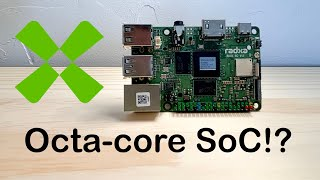

In this video, I review Radxa's ROCK 5C, a powerful single-board computer powered by the 8-core Rockchip RK3588S2 SoC, featuring 4x Cortex-A76 and 4x Cortex-A55 cores.

Posted on YouTube: [https://youtu.be/R3_6UD4P_OY](https://youtu.be/R3_6UD4P_OY)