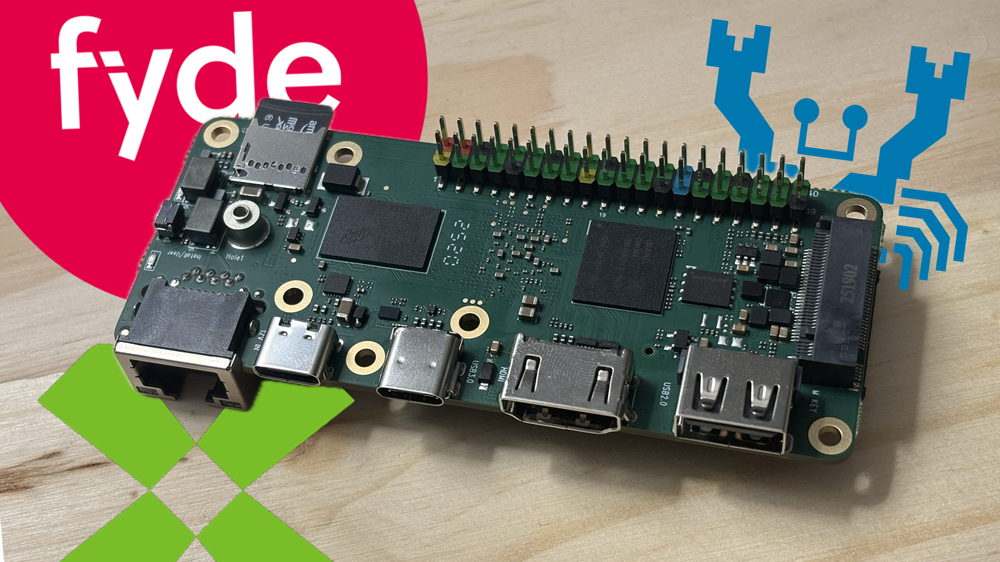

Posted on YouTube: [https://youtu.be/kRo1J3hDRH0](https://youtu.be/kRo1J3hDRH0)

The XpressReal T3 is a very interesting SBC made by FydeOS, also known as Fyde Innovations. Although it’s an intriguing piece of hardware, I’m not sure who or what it’s intended for. When a XpressReal T3 costs £44.44 (or $58.48), it’s around the same price as a Raspberry Pi 5, which is 3–4 times faster.

<!--  -->


## Basic Information:

  - Board URL (official): https://xpressreal.io/
  - Board purchased from: FydeOS or (https://madeforfydeos.com/)
  - Board purchase date: August 9th, 2025 (sent to me by FydeOS)
  - Board specs (as tested): 4GB RAM + 32GB eMMC
  - Board price (as tested): £44.44 or $58.48

## Linux/System Information:

```
# output of `screenfetch`
                          ./+o+-       ryderhutchings@xpressreal-t3
                  yyyyy- -yyyyyy+      OS: Ubuntu 24.04 noble
               ://+//////-yyyyyyo      Kernel: aarch64 Linux 6.6.54-vendor-realtek-rtd1619b
           .++ .:/++++++/-.+sss/`      Uptime: 2h 38m
         .:++o:  /++++++++/:--:/-      Packages: 1443
        o:+o+:++.`..```.-/oo+++++/     Shell: bash 5.2.21
       .:+o:+o/.          `+sssoo+/    Disk: 7.6G / 173G (5%)
  .++/+:+oo+o:`             /sssooo.   CPU: ARM Cortex-A55 @ 4x 1.7GHz
 /+++//+:`oo+o               /::--:.   RAM: 599MiB / 3851MiB
 \+/+o+++`o++o               ++////.  
  .++.o+++oo+:`             /dddhhh.  
       .+.o+oo:.          `oddhhhh+   
        \+.++o+o``-````.:ohdhhhhh+    
         `:o+++ `ohhhhhhhhyo++os:     
           .o:`.syhhhhhhh/.oo++o`     
               /osyyyyyyo++ooo+++/    
                   ````` +oo+++o\:    
                          `oo++.  

# output of `uname -a`
Linux xpressreal-t3 6.6.54-vendor-realtek-rtd1619b #1 SMP PREEMPT Thu Sep 11 03:52:23 UTC 2025 aarch64 aarch64 aarch64 GNU/Linux

```
## System Topology:
TODO: Paste the output of lstopo lstopo.png here (install the hwloc package to get lstopo).

Note: lstopo results may be missing some information on new and strange SoCs.

## Benchmark Results:

### CPU

#### `Geekbench 6` results: 
- See: [https://browser.geekbench.com/v6/cpu/14915764](https://browser.geekbench.com/v6/cpu/14915764) and [https://browser.geekbench.com/v6/cpu/15074593](https://browser.geekbench.com/v6/cpu/15074593)

- 233 Single-Core Score / 733 Multi-Core Score

#### `top500-benchmark` results:

- See: [geerlingguy/top500-benchmark](https://github.com/geerlingguy/top500-benchmark)

- 11.114 Gflops at 5.2–6 W, for ~1.99 Gflops/W
<details>
<summary>Click to expand HPLinpack / top500-benchmark results</summary>

```
        ================================================================================
        HPLinpack 2.3  --  High-Performance Linpack benchmark  --   December 2, 2018
        Written by A. Petitet and R. Clint Whaley,  Innovative Computing Laboratory, UTK
        Modified by Piotr Luszczek, Innovative Computing Laboratory, UTK
        Modified by Julien Langou, University of Colorado Denver
        ================================================================================

        An explanation of the input/output parameters follows:
        T/V    : Wall time / encoded variant.
        N      : The order of the coefficient matrix A.
        NB     : The partitioning blocking factor.
        P      : The number of process rows.
        Q      : The number of process columns.
        Time   : Time in seconds to solve the linear system.
        Gflops : Rate of execution for solving the linear system.

        The following parameter values will be used:

        N      :   14745
        NB     :     256
        PMAP   : Row-major process mapping
        P      :       1
        Q      :       4
        PFACT  :   Right
        NBMIN  :       4
        NDIV   :       2
        RFACT  :   Crout
        BCAST  :  1ringM
        DEPTH  :       1
        SWAP   : Mix (threshold = 64)
        L1     : transposed form
        U      : transposed form
        EQUIL  : yes
        ALIGN  : 8 double precision words

        --------------------------------------------------------------------------------

        - The matrix A is randomly generated for each test.
        - The following scaled residual check will be computed:
              ||Ax-b||_oo / ( eps * ( || x ||_oo * || A ||_oo + || b ||_oo ) * N )
        - The relative machine precision (eps) is taken to be               1.110223e-16
        - Computational tests pass if scaled residuals are less than                16.0

        ================================================================================
        T/V                N    NB     P     Q               Time                 Gflops
        --------------------------------------------------------------------------------
        WR11C2R4       14745   256     1     4             192.33             1.1114e+01
        HPL_pdgesv() start time Sat Nov  8 19:48:14 2025

        HPL_pdgesv() end time   Sat Nov  8 19:51:26 2025

        --------------------------------------------------------------------------------
        ||Ax-b||_oo/(eps*(||A||_oo*||x||_oo+||b||_oo)*N)=   4.07780599e-03 ...... PASSED
        ================================================================================

        Finished      1 tests with the following results:
                      1 tests completed and passed residual checks,
                      0 tests completed and failed residual checks,
                      0 tests skipped because of illegal input values.
        --------------------------------------------------------------------------------

        End of Tests.
        ================================================================================ 
```
</details>

#### `sysbench` results:
- See: [akopytov/sysbench](https://github.com/akopytov/sysbench)

```
CPU speed:
    events per second:  1286.78

General statistics:
    total time:                          10.0028s
    total number of events:              12874

Latency (ms):
         min:                                    2.95
         avg:                                    3.11
         max:                                   23.19
         95th percentile:                        3.02
         sum:                                39992.06

Threads fairness:
    events (avg/stddev):           3218.5000/16.47
    execution time (avg/stddev):   9.9980/0.00
```
[comment]: # (sysbench cpu --cpu-max-prime=20000 --threads=4 run)

### Thermals
- See: [ryderhutchings/rk-thermal.sh](https://github.com/ryderhutchings/rk-thermal.sh)

| Test Condition           | With Heatsink (°C) | Without Heatsink (°C) | Notes |
|--------------------------|-------------------|----------------------|-------|
| Idle (Desktop)           | TODO              | 47–50                | Baseline thermal behavior |
| Web Browsing             | TODO              | 52–68                | Typical mixed usage range; acceptable and responsive |
| 1080p YouTube Playback   | TODO              | 68–75                | Typical multimedia load; acceptable but nothing exceptional |
| 4K YouTube Playback      | TODO              | 76–77                | Frequent buffering and frame drops; not recommended for 4K playback |
| stress-ng (--cpu 80)     | TODO              | 77–80                | Gradual temperature rise; remained surprisingly cool |
| sbc-bench Run            | 90              | TODO                 | Compare to stress-ng for peak temperature during full suite |

### Power

  - Idle shutdown power draw (at wall): 0.4 W
  - Idle on desktop power draw (at wall): 2.4 W to 3 W
  - Maximum simulated power draw (`stress-ng --matrix 0`): 4.8 W to 6.2 W
  - During Geekbench single-core benchmark: 3 W to 4.1 W
  - During Geekbench multi-core benchmark: 3.2 W to 5.2 W
  - During `top500` HPL benchmark: 5.2 W to 6 W

### Disk

#### Onboard eMMC (SDINBDV4-32G)

[comment]: # (Run `lsblk -o NAME,FSTYPE,LABEL,MOUNTPOINT,SIZE,MODEL` to get model)

| Benchmark                  | Result |
| -------------------------- | ------ |
| iozone 4K random read      | 20.2 MB/s |
| iozone 4K random write     | 27.9 MB/s |
| iozone 1M random read      | 245.5 MB/s |
| iozone 1M random write     | 222.7 MB/s |
| iozone 1M sequential read  | 243.0 MB/s |
| iozone 1M sequential write | 222.7 MB/s |

#### External microSD (USD00-128GB)

| Benchmark                  | Result |
| -------------------------- | ------ |
| iozone 4K random read      | 17 MB/s |
| iozone 4K random write     | 3.1 MB/s |
| iozone 1M random read      | 81.5 MB/s |
| iozone 1M random write     | 42.4 MB/s |
| iozone 1M sequential read  | 81.1 MB/s |
| iozone 1M sequential write | 66.0 MB/s |

### Network

> Note: All measurements were taken over Wi-Fi, not wired Ethernet.

`iperf3` results:

  - `iperf3 -c $SERVER_IP`: 63 Mbps
  - `iperf3 -c $SERVER_IP --reverse`: 94 Mbps
  - `iperf3 -c $SERVER_IP --bidir`: 44 Mbps up, 40 Mbps down

`nuttcp` results:

  - `nuttcp -t $SERVER_IP`: 76.4 MB / 10.39 sec = 61.7 Mbps

### GPU

`glmark2-es2` / `glmark2-es2-wayland` results:

```
=======================================================
    glmark2 2023.01
=======================================================
    OpenGL Information
    GL_VENDOR:      Mesa
    GL_RENDERER:    Mali-G57 (Panfrost)
    GL_VERSION:     OpenGL ES 3.1 Mesa 25.0.7-0ubuntu0.24.04.2
    Surface Config: buf=32 r=8 g=8 b=8 a=8 depth=24 stencil=0 samples=0
    Surface Size:   800x600 windowed
=======================================================
[build] use-vbo=false: FPS: 559 FrameTime: 1.789 ms
[build] use-vbo=true: FPS: 629 FrameTime: 1.590 ms
[texture] texture-filter=nearest: FPS: 716 FrameTime: 1.397 ms
[texture] texture-filter=linear: FPS: 846 FrameTime: 1.183 ms
[texture] texture-filter=mipmap: FPS: 869 FrameTime: 1.152 ms
[shading] shading=gouraud: FPS: 685 FrameTime: 1.462 ms
[shading] shading=blinn-phong-inf: FPS: 665 FrameTime: 1.504 ms
[shading] shading=phong: FPS: 560 FrameTime: 1.786 ms
[shading] shading=cel: FPS: 547 FrameTime: 1.829 ms
[bump] bump-render=high-poly: FPS: 389 FrameTime: 2.571 ms
[bump] bump-render=normals: FPS: 900 FrameTime: 1.112 ms
[bump] bump-render=height: FPS: 833 FrameTime: 1.201 ms
[effect2d] kernel=0,1,0;1,-4,1;0,1,0;: FPS: 519 FrameTime: 1.930 ms
[effect2d] kernel=1,1,1,1,1;1,1,1,1,1;1,1,1,1,1;: FPS: 242 FrameTime: 4.136 ms
[pulsar] light=false:quads=5:texture=false: FPS: 808 FrameTime: 1.238 ms
[desktop] blur-radius=5:effect=blur:passes=1:separable=true:windows=4: FPS: 213 FrameTime: 4.699 ms
[desktop] effect=shadow:windows=4: FPS: 474 FrameTime: 2.110 ms
[buffer] columns=200:interleave=false:update-dispersion=0.9:update-fraction=0.5:update-method=map: FPS: 73 FrameTime: 13.783 ms
[buffer] columns=200:interleave=false:update-dispersion=0.9:update-fraction=0.5:update-method=subdata: FPS: 73 FrameTime: 13.871 ms
[buffer] columns=200:interleave=true:update-dispersion=0.9:update-fraction=0.5:update-method=map: FPS: 84 FrameTime: 11.937 ms
[ideas] speed=duration: FPS: 417 FrameTime: 2.402 ms
[jellyfish] <default>: FPS: 298 FrameTime: 3.361 ms
[terrain] <default>: FPS: 38 FrameTime: 26.627 ms
[shadow] <default>: FPS: 498 FrameTime: 2.008 ms
[refract] <default>: FPS: 83 FrameTime: 12.137 ms
[conditionals] fragment-steps=0:vertex-steps=0: FPS: 945 FrameTime: 1.059 ms
[conditionals] fragment-steps=5:vertex-steps=0: FPS: 774 FrameTime: 1.293 ms
[conditionals] fragment-steps=0:vertex-steps=5: FPS: 940 FrameTime: 1.064 ms
[function] fragment-complexity=low:fragment-steps=5: FPS: 885 FrameTime: 1.130 ms
[function] fragment-complexity=medium:fragment-steps=5: FPS: 495 FrameTime: 2.024 ms
[loop] fragment-loop=false:fragment-steps=5:vertex-steps=5: FPS: 619 FrameTime: 1.617 ms
[loop] fragment-steps=5:fragment-uniform=false:vertex-steps=5: FPS: 659 FrameTime: 1.519 ms
[loop] fragment-steps=5:fragment-uniform=true:vertex-steps=5: FPS: 550 FrameTime: 1.821 ms
=======================================================
                                  glmark2 Score: 540 
=======================================================
```

## vkmark
N/A

## GravityMark
N/A

## AI / LLM Inference:

Basic `ollama` LLM model inference results:

Running benchmark 3 times using model: `tinyllama:1.1b`
| Run | Eval Rate (Tokens/Second) |
|-----|-----------------------------|
| 1 | 4.50 tokens/s |
| 2 | 4.68 tokens/s |
| 3 | 4.54 tokens/s |
|**Average Eval Rate**| 4.57 tokens/second |

Running benchmark 3 times using model: `deepseek-r1:1.5b`
| Run | Eval Rate (Tokens/Second) |
|-----|-----------------------------|
| 1 | 2.74 tokens/s |
| 2 | 2.77 tokens/s |
| 3 | 2.78 tokens/s |
|**Average Eval Rate**| 2.76 tokens/second |

Running benchmark 3 times using model: `llama3.2:3b`
| Run | Eval Rate (Tokens/Second) |
|-----|-----------------------------|
| 1 | 1.35 tokens/s |
| 2 | 1.19 tokens/s |
| 3 | 1.36 tokens/s |
|**Average Eval Rate**| 1.30 tokens/second |

System used around 5 W during inference.

[comment]: # (Note that Ollama will run on the CPU if no valid GPU / drivers are present. Be sure to note whether Ollama runs on the CPU, GPU, or a dedicated NPU.)

## Memory:

### `tinymembench` results:

See: [rojaster/tinymembench](https://github.com/rojaster/tinymembench)

<details>
<summary>Click to expand tinymembench benchmark results</summary>

```
tinymembench v0.4.10 (simple benchmark for memory throughput and latency)

==========================================================================
== Memory bandwidth tests                                               ==
==                                                                      ==
== Note 1: 1MB = 1000000 bytes                                          ==
== Note 2: Results for 'copy' tests show how many bytes can be          ==
==         copied per second (adding together read and writen           ==
==         bytes would have provided twice higher numbers)              ==
== Note 3: 2-pass copy means that we are using a small temporary buffer ==
==         to first fetch data into it, and only then write it to the   ==
==         destination (source -> L1 cache, L1 cache -> destination)    ==
== Note 4: If sample standard deviation exceeds 0.1%, it is shown in    ==
==         brackets                                                     ==
==========================================================================

 C copy backwards                                     :   1910.0 MB/s (0.9%)
 C copy backwards (32 byte blocks)                    :   1900.3 MB/s (0.8%)
 C copy backwards (64 byte blocks)                    :   1915.3 MB/s (0.8%)
 C copy                                               :   3594.7 MB/s (0.7%)
 C copy prefetched (32 bytes step)                    :   1761.7 MB/s (0.6%)
 C copy prefetched (64 bytes step)                    :   3637.5 MB/s (0.7%)
 C 2-pass copy                                        :   2395.0 MB/s (0.3%)
 C 2-pass copy prefetched (32 bytes step)             :   1355.2 MB/s (0.5%)
 C 2-pass copy prefetched (64 bytes step)             :   2005.7 MB/s (0.6%)
 C fill                                               :   6628.4 MB/s (0.5%)
 C fill (shuffle within 16 byte blocks)               :   6628.0 MB/s (0.5%)
 C fill (shuffle within 32 byte blocks)               :   6628.5 MB/s (0.5%)
 C fill (shuffle within 64 byte blocks)               :   6626.7 MB/s (0.7%)
 NEON 64x2 COPY                                       :   3589.3 MB/s
 NEON 64x2x4 COPY                                     :   3589.1 MB/s (0.7%)
 NEON 64x1x4_x2 COPY                                  :   3574.1 MB/s (0.7%)
 NEON 64x2 COPY prefetch x2                           :   2377.3 MB/s (0.8%)
 NEON 64x2x4 COPY prefetch x1                         :   2481.2 MB/s (0.9%)
 NEON 64x2 COPY prefetch x1                           :   2398.8 MB/s (0.7%)
 NEON 64x2x4 COPY prefetch x1                         :   2480.8 MB/s (0.7%)
 ---
 standard memcpy                                      :   3596.6 MB/s (0.7%)
 standard memset                                      :   6666.9 MB/s (0.6%)
 ---
 NEON LDP/STP copy                                    :   3593.9 MB/s (1.3%)
 NEON LDP/STP copy pldl2strm (32 bytes step)          :   1466.7 MB/s (0.4%)
 NEON LDP/STP copy pldl2strm (64 bytes step)          :   2770.5 MB/s (0.5%)
 NEON LDP/STP copy pldl1keep (32 bytes step)          :   2048.6 MB/s (0.8%)
 NEON LDP/STP copy pldl1keep (64 bytes step)          :   3638.2 MB/s (0.7%)
 NEON LD1/ST1 copy                                    :   3590.6 MB/s (0.7%)
 NEON STP fill                                        :   6670.1 MB/s (0.7%)
 NEON STNP fill                                       :   6570.1 MB/s (0.4%)
 ARM LDP/STP copy                                     :   3593.3 MB/s (0.7%)
 ARM STP fill                                         :   6668.4 MB/s (0.6%)
 ARM STNP fill                                        :   6568.6 MB/s (0.5%)

==========================================================================
== Memory latency test                                                  ==
==                                                                      ==
== Average time is measured for random memory accesses in the buffers   ==
== of different sizes. The larger is the buffer, the more significant   ==
== are relative contributions of TLB, L1/L2 cache misses and SDRAM      ==
== accesses. For extremely large buffer sizes we are expecting to see   ==
== page table walk with several requests to SDRAM for almost every      ==
== memory access (though 64MiB is not nearly large enough to experience ==
== this effect to its fullest).                                         ==
==                                                                      ==
== Note 1: All the numbers are representing extra time, which needs to  ==
==         be added to L1 cache latency. The cycle timings for L1 cache ==
==         latency can be usually found in the processor documentation. ==
== Note 2: Dual random read means that we are simultaneously performing ==
==         two independent memory accesses at a time. In the case if    ==
==         the memory subsystem can't handle multiple outstanding       ==
==         requests, dual random read has the same timings as two       ==
==         single reads performed one after another.                    ==
==========================================================================

block size : single random read / dual random read
      1024 :    0.0 ns          /     0.0 ns 
      2048 :    0.0 ns          /     0.0 ns 
      4096 :    0.0 ns          /     0.0 ns 
      8192 :    0.0 ns          /     0.0 ns 
     16384 :    0.1 ns          /     0.2 ns 
     32768 :    0.7 ns          /     1.0 ns 
     65536 :    1.6 ns          /     2.8 ns 
    131072 :    3.4 ns          /     5.5 ns 
    262144 :   10.2 ns          /    15.2 ns 
    524288 :   15.1 ns          /    19.6 ns 
   1048576 :   21.7 ns          /    28.1 ns 
   2097152 :   74.8 ns          /   107.7 ns 
   4194304 :  107.3 ns          /   140.2 ns 
   8388608 :  128.6 ns          /   157.1 ns 
  16777216 :  139.5 ns          /   164.6 ns 
  33554432 :  147.2 ns          /   170.4 ns 
  67108864 :  155.6 ns          /   180.6 ns 
```
</details>


### `c2clat` results:
See: [rigtorp/c2clat](https://github.com/rigtorp/c2clat):

Core-to-core memory latency across the CPU.

[comment]: # (If this is a new CPU/SoC, run c2clat to generate a core to core memory access latency graph: https://gist.github.com/geerlingguy/842974c0e49c201c28f4be54a05cc89c)


### `sbc-bench` results:
See: [ThomasKaiser/sbc-bench](https://github.com/ThomasKaiser/sbc-bench): 

```
  * memcpy: 3590.4 MB/s, memchr: 2609.2 MB/s, memset: 6648.1 MB/s
  * 16M latency: 149.9 150.4 151.6 151.1 150.2 152.2 240.4 452.9 
  * 128M latency: 166.8 165.6 163.0 165.2 163.4 170.5 250.4 463.6 
  * 7-zip MIPS (3 consecutive runs): 5016, 4937, 5011 (4990 avg), single-threaded: 1429
  * `aes-256-cbc     130220.53k   348242.92k   602365.10k   737659.90k   789995.52k   792881.83k`
  * `aes-256-cbc     131206.15k   351302.08k   605413.46k   738945.71k   790585.34k   794389.16k`
```

<details>
<summary>Click to expand sbc-bench benchmark results</summary>

# Realtek Bleeding Edge EVB or XpressReal T3 (4GB)

Tested with sbc-bench v0.9.72 on Sun, 09 Nov 2025 08:32:15 -0700.

### General information:

    Realtek Stark RTD1619B rev A00, RealTek RTD1619B, Kernel: aarch64, Userland: arm64
    
    CPU sysfs topology (clusters, cpufreq members, clockspeeds)
                     cpufreq   min    max
     CPU    cluster  policy   speed  speed   core type
      0        0        0     1100    1700   Cortex-A55 / r2p0
      1        0        0     1100    1700   Cortex-A55 / r2p0
      2        0        0     1100    1700   Cortex-A55 / r2p0
      3        0        0     1100    1700   Cortex-A55 / r2p0

3851 KB available RAM

### Governors/policies (performance vs. idle consumption):

Original governor settings:

    cpufreq-policy0: schedutil / 1200 MHz (conservative ondemand userspace powersave performance schedutil / 1100 1200 1300 1400 1500 1600 1700)

Tuned governor settings:

    cpufreq-policy0: performance / 1700 MHz

### Clockspeeds (idle vs. heated up):

Before at 41.1°C:

    cpu0 (Cortex-A55): OPP: 1700, Measured: 1696 

After at 67.2°C:

    cpu0 (Cortex-A55): OPP: 1700, Measured: 1697 

### Performance baseline

  * memcpy: 3590.4 MB/s, memchr: 2609.2 MB/s, memset: 6648.1 MB/s
  * 16M latency: 149.9 150.4 151.6 151.1 150.2 152.2 240.4 452.9 
  * 128M latency: 166.8 165.6 163.0 165.2 163.4 170.5 250.4 463.6 
  * 7-zip MIPS (3 consecutive runs): 5016, 4937, 5011 (4990 avg), single-threaded: 1429
  * `aes-256-cbc     130220.53k   348242.92k   602365.10k   737659.90k   789995.52k   792881.83k`
  * `aes-256-cbc     131206.15k   351302.08k   605413.46k   738945.71k   790585.34k   794389.16k`

### Storage devices:

  * 29.1GB "SanDisk/Toshiba DV4032" HS400 eMMC 5.1 card as /dev/mmcblk0: date 02/2025, manfid/oemid: 0x000045/0x0100, hw/fw rev: 0x0/0x5243333042303037
  * 117.8GB "Longsys USD00" UHS SDR104 SDXC card as /dev/mmcblk1: date 11/2024, manfid/oemid: 0x0000ad/0x4c53, hw/fw rev: 0x1/0x0
  * Winbond W25X40 0MB SPI NOR flash, drivers in use: spi-nor/rtk-sfc/simple-pm-bus/simple-pm-bus

### Swap configuration:

  * /dev/zram0: 1.9G (0K used, lzo-rle, 4 streams, 4K data, 74B compressed, 12K total)

### Software versions:

  * Ubuntu 24.04 LTS (Noble Numbat) tampered by Armbian_community 25.11.0-trunk.413 noble
  * Build scripts: https://github.com/armbian/build, 25.11.0-trunk.413, XpressReal T3, realtek-rtd1619b, realtek-rtd1619b
  * Compiler: /usr/bin/gcc (Ubuntu 13.3.0-6ubuntu2~24.04) 13.3.0 / aarch64-linux-gnu
  * OpenSSL 3.0.13, built on 30 Jan 2024 (Library: OpenSSL 3.0.13 30 Jan 2024)    

### Kernel info:

  * /proc/cmdline: rootfstype=ext4 splash=verbose console=ttyS0,460800 console=tty1 consoleblank=0 loglevel=1
  * Vulnerability Spectre v1:             Mitigation; __user pointer sanitization
  * Kernel 6.6.54-vendor-realtek-rtd1619b / CONFIG_HZ=250

All known settings adjusted for performance. Device now ready for benchmarking.
Once finished stop with [ctrl]-[c] to get info about throttling, frequency cap
and too high background activity all potentially invalidating benchmark scores.
All changes with storage and PCIe devices as well as suspicious dmesg contents
will be reported too. 

</details>


## Phoronix Test Suite

See: [geerlingguy/sbc-general-benchmark.sh](https://gist.github.com/geerlingguy/570e13f4f81a40a5395688667b1f79af):

  - pts/encode-mp3: 41.397 sec
  - pts/x264 1080p: 4.18 fps
  - pts/x264 4K: 0.95 fps
  - pts/phpbench: 103313
  - pts/build-linux-kernel (defconfig): 8152.982 sec